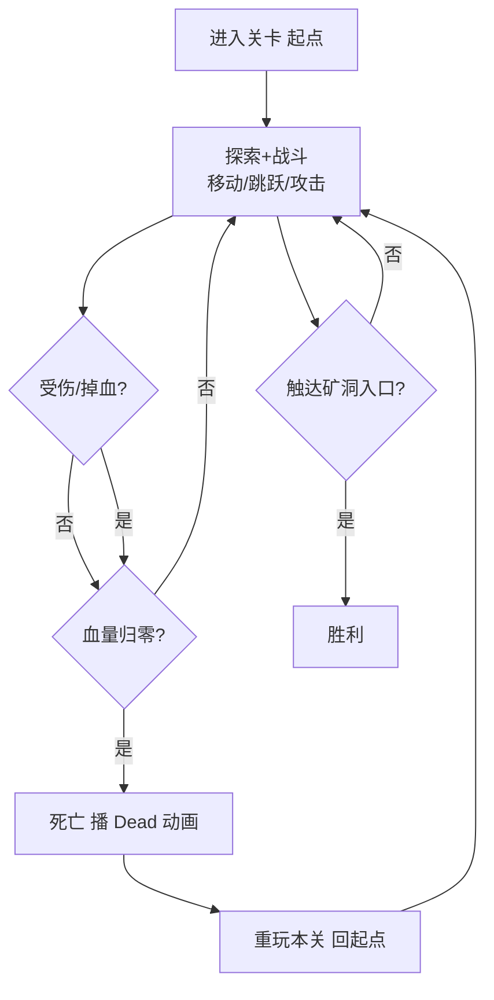
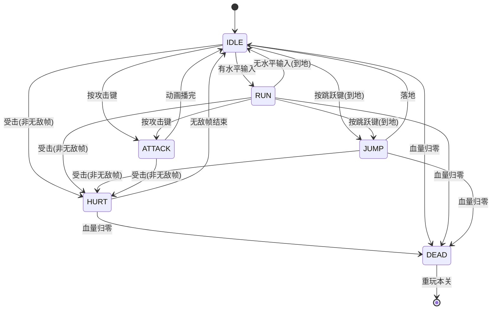
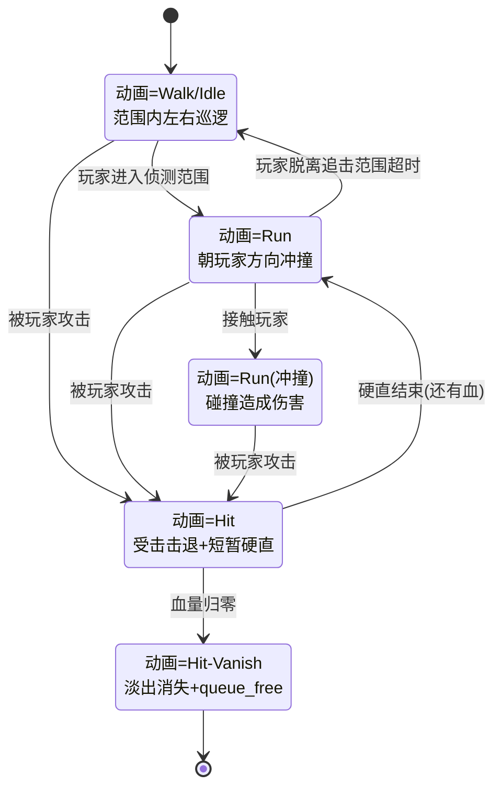
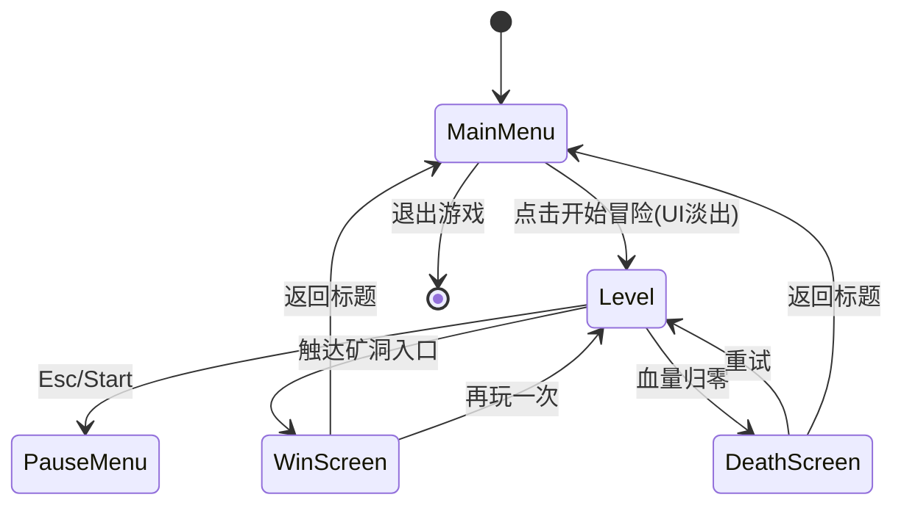
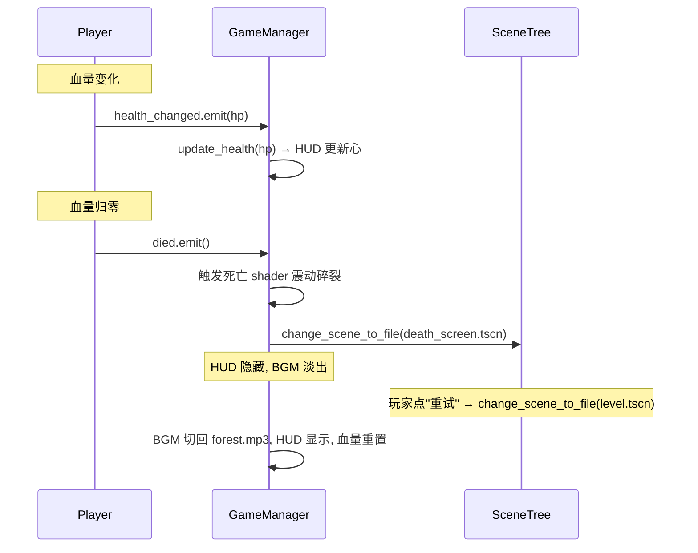

# 核心玩法设计（GDD）

> 文档定位：**MVP 核心玩法与游戏设计文档（GDD）**，是后续架构设计、关卡搭建、开发实现的最高依据。
> 阶段：**MVP**（满足所有 `[P0]` 约束）。
> 上游依据：参考截图 `docs/00_scratch/game_play.png` / `game_play_2.png`；资产清单见 [`03_美术规范/01_美术资产清单.md`](../03_美术规范/01_美术资产清单.md) 与 [`04_音频规范/01_音频资产清单.md`](../04_音频规范/01_音频资产清单.md)。
> 本文件位于 `docs/`（已加 `.gdignore`，不参与 Godot 导入）。架构图/状态机/流程图遵从全局宪法 §3.3 用 **Mermaid** 绘制。

---

## 目录

- [1. 游戏概述](#1-游戏概述)
- [2. 核心玩法循环](#2-核心玩法循环)
- [3. 关卡设计](#3-关卡设计)
- [4. 主角能力与数值](#4-主角能力与数值)
- [5. 野猪 AI 与数值](#5-野猪-ai-与数值)
- [6. 输入映射](#6-输入映射)
- [7. HUD 与 UI](#7-hud-与-ui)
- [8. 场景流与架构](#8-场景流与架构)
- [9. 胜负画面 Shader 特效](#9-胜负画面-shader-特效)
- [10. 资产—玩法映射](#10-资产玩法映射)
- [11. 资产缺口与处理](#11-资产缺口与处理)
- [12. MVP 验收标准](#12-mvp-验收标准)

---

## 1. 游戏概述

### 1.1 游戏主题

**《勇士的冒险：野猪林突围》**（Brave Adventure: Boarwood Breakthrough）

一名持剑勇士深入被野猪群盘踞的「野猪林」，必须一路斩杀或绕过冲撞而来的野猪，穿越三段渐进难度的森林地形，抵达终点的**矿洞入口**。

- **美术基调**：16-bit 像素艺术，暖色调森林奇幻（完全复用 `Legacy-Fantasy High Forest 2.3` 包）。
- **情感基调**：轻松明快的复古动作闯关，不恐怖、不沉重。
- **叙事伏笔**：抵达矿洞入口为后续「矿洞探险」扩展埋下伏笔（MVP 不进入内部）。

### 1.2 游戏类型与定位

| 属性 | 值 |
|------|-----|
| 类型 | 2D 横版线性动作闯关（Side-scroller Action） |
| 战斗深度 | 中度（血量/受击/击退/无敌帧/护甲递增） |
| 关卡规模 | 单关卡 |
| 一次过关时长 | 约 2~4 分钟 |
| 目标平台 | PC（键盘 + 手柄） |
| 阶段 | MVP |

---

## 2. 核心玩法循环

### 2.1 单局循环



**循环三要素**：
1. **探索**：横版向右推进，跨越平台/坑洞/高低差地形。
2. **战斗**：野猪阻拦 → 玩家挥剑攻击（含击退/无敌帧）→ 野猪死亡或玩家受伤。
3. **目标判定**：触达矿洞入口 = 过关；血量归零 = 死亡重玩。

### 2.2 典型体验节奏

```
[起点] →→ 林缘(段①) →→ 密林(段②) →→ 突围(段③) →→ [矿洞入口]
        教学1~2猪       核心3~5猪       密集2~3猪
        宽阔地形         平台+走位       同时冲撞逼突围
        ~40秒            ~90秒           ~50秒
```

---

## 3. 关卡设计

### 3.1 关卡整体布局

单向向右推进的横版地图，总长约 **150 格**（16px/格 × 150 = 2400px，约为视口 320px 的 **7.5 屏宽**）。玩家从左端起点出发，向右穿越三段，抵达右端矿洞入口。

```
视口 320×180，关卡总宽 ~2400px（约 7.5 屏）

  屏1     屏2     屏3     屏4     屏5     屏6     屏7   屏8(半)
┌────┐ ┌────┐ ┌────┐ ┌────┐ ┌────┐ ┌────┐ ┌────┐ ┌───┐
│起点│→│段① │→│段② │→│段② │→│段② │→│段③ │→│段③ │→.. │
│林缘│ │林缘│ │密林│ │密林│ │密林│ │突围│ │突围│ │   │
│教学│ │教学│ │核心│ │核心│ │核心│ │高潮│ │高潮│ │   │
└────┘ └────┘ └────┘ └────┘ └────┘ └────┘ └────┘ └───┘
  ↑                                                 ↑
 起点                                          矿洞入口(终点)
```

### 3.2 三段分段设计

#### 段① 林缘（教学段）— 屏1~屏2 前半

| 项 | 设计 |
|---|---|
| 目的 | 教玩家移动、跳跃、攻击三个基本操作 |
| 地形 | 宽阔平地为主，1~2 个低矮台阶（1~2 格高），无坑洞 |
| 野猪 | 1~2 只，分散放置，巡逻范围小；面向新手，反应慢 |
| 教学引导 | 起点附近地面贴操作提示（键盘图标，来自 gdb 包）："← → 移动 / Space 跳跃 / J 攻击" |

#### 段② 密林（核心段）— 屏2 后半~屏4

| 项 | 设计 |
|---|---|
| 目的 | 考验"战斗 + 平台跳跃"组合操作 |
| 地形 | 引入 2~3 格高平台、1~2 个坑洞（**掉下扣血自动弹回**最近平台）、树木分层遮挡（角色可走在树后，用 y_sort） |
| 野猪 | 3~5 只，密度提升，部分野猪 Run 冲撞速度更快 |

#### 段③ 突围（高潮段）— 屏5

| 项 | 设计 |
|---|---|
| 目的 | 综合考验，制造过关前的最后挑战 |
| 地形 | 开阔战场 + 1 个中央高台（可上下走位躲避冲撞） |
| 野猪 | 2~3 只同时出现，冲撞积极，逼玩家用"攻击+跳跃"组合突围 |
| 终点 | 击退/绕过最后这波后，触达矿洞入口 → 胜利 |

**野猪总数**：约 8~10 只（1~2 + 3~5 + 2~3），全部使用 Boar 资产。

### 3.3 地形分层（复用已配 TileSet）

```
渲染层级（从远到近）：
┌──────────────────────────────────────┐
│ ParallaxBackground · Background.png  │  最远层，motion_scale~0.2
├──────────────────────────────────────┤
│ TileMapLayer · background.tres(Leaves)│  背景树冠，不碰撞
├──────────────────────────────────────┤
│ TileMapLayer · geometry.tres(Trunk)   │  树干碰撞层(collision_layer=1)
├──────────────────────────────────────┤
│ TileMapLayer · cave.tres(Grass)       │  草地碰撞层(collision_layer=1)
├──────────────────────────────────────┤
│ 玩家 / 野猪 / 矿洞入口 (y_sort_enabled)│  角色层
├──────────────────────────────────────┤
│ TileMapLayer · foreground.tres        │  前景树梢遮挡(不碰撞)
└──────────────────────────────────────┘
```

### 3.4 矿洞入口（终点）

关卡右端放一个 **矿洞入口节点**（`Area2D`），玩家进入其碰撞区域即触发胜利。

```
关卡右端（屏5 末尾）：

        ┌───┐▓▓▓┌───┐      ← Buildings.png 的拱门/屋顶元素拼门框
        │   │▓▓▓│   │
        │   │▓▓▓│   │      ← ▓ = 纯黑或洞穴壁填充，营造"黑洞洞的入口"
   ═════╧═══╧▓▓▓╧═══╧═════  ← 地面
              ▲
         Area2D 触发区
      （玩家进入 = 胜利）
```

- **门框**：用 `Assets/Buildings.png` 的拱门/门框/屋顶瓦片拼出对称入口。
- **洞口**：门框内侧填充黑色（或用 `cave.tres` 的洞穴壁瓦片），制造纵深暗色对比。
- **交互**：`Area2D` 碰撞区域覆盖洞口前方，玩家 body 进入即触发 `level_completed` 信号 → 胜利。

> 矿洞入口视觉精调属宪法 §12.4 用户精调项（拱门瓦片选型/黑色填充范围由编辑器精调）。

---

## 4. 主角能力与数值

### 4.1 主角能力清单

| 能力 | 操作 | 说明 |
|---|---|---|
| 水平移动 | ← → / 左摇杆 | 加速度+摩擦力模型，非瞬移 |
| 跳跃 | Space / A键(Xbox) / ✕(PS) | 可跳上 2~3 格高平台；variable jump（松开键跳得低） |
| 近战攻击 | J / X键(Xbox) / □(PS) | 挥剑，前方命中框；攻击时短暂减速（挥砍手感） |
| 受击 | （被动） | 被野猪碰撞/冲撞时扣血，触发击退 + 无敌帧 |
| 死亡 | （被动） | 血量归零播 Dead 动画 → 重玩本关 |

### 4.2 主角数值（数据驱动 `PlayerStats.tres`）

| 参数 | 值 | 设计依据 |
|---|---|---|
| 最大血量 `max_health` | 100 | 分 5 段，HUD 显示 5 颗心，每颗 20 |
| 受击伤害（被野猪撞） | 20 | 扣 1 颗心，可被击 5 次（友好试错） |
| 移动速度 `move_speed` | 160 px/s | 视口 480 宽 → 约 3 秒/屏，节奏适中 |
| 加速度 `acceleration` | 1200 px/s² | 起步响应快 |
| 摩擦力 `friction` | 1200 px/s² | 松手快速停止 |
| 跳跃力 `jump_velocity` | -280 px/s | 可跳约 3 格（48px）高平台 |
| 重力 `gravity` | 900 px/s² | 标准横版手感 |
| 变速跳跃倍率 | 0.5 | 松开跳跃键，上升速度减半（可控跳跃高度） |
| 攻击伤害 `attack_damage` | 15 | 野猪 HP 30 → 2 击致死 |
| 攻击冷却 | 0.45 s | 防止狂按，Attack 动画 12帧@15fps≈0.8s，冷却取中段 |
| 无敌帧 `invincible_duration` | 1.0 s | 受击后闪烁，期间不再受伤 |
| 击退力 `knockback` | 150 px/s | 受击后向反方向弹开 |

> 数值全部走 `Resource`（`@export`），可在 Inspector 调参，MVP 试玩后微调。

### 4.3 主角状态机



> **受击动画缺口**：主角无独立 Hurt 动画。`HURT` 状态用 Attack 起手帧（前 2 帧）或 Idle 闪烁临时代替（宪法允许 MVP 临时代替）。具体实现时定。

### 4.4 攻击命中判定

```
攻击挥剑（面向右为例）：

   主角(64×80)
   ┌────────┐
   │  剑士   │═══> 命中框 Area2D
   │  身体   │     (在 Attack 第5~7帧激活)
   │        │     尺寸 ~24×40，偏移在身体前方
   └────────┘
        │
        ▼ 命中野猪 Hurtbox → 扣血/击退
```

- 用 Hitbox/Hurtbox 组件模式（宪法 §5.2 组件系统，MVP 简化版）。
- 命中框仅在 Attack 动画**第 5~7 帧**（挥剑中段）激活，其余帧关闭。

---

## 5. 野猪 AI 与数值

### 5.1 野猪行为状态机



### 5.2 野猪数值（数据驱动 `BoarStats.tres`）

| 参数 | 值 | 设计依据 |
|---|---|---|
| 最大血量 `max_health` | 30 | 主角攻击 15 → 2 击致死 |
| 接触伤害 `contact_damage` | 20 | 撞到玩家扣 1 颗心 |
| 巡逻速度 `patrol_speed` | 40 px/s | 缓慢游荡，远慢于玩家(160) |
| 冲撞速度 `chase_speed` | 120 px/s | 接近玩家的 75%，能追上但有逃命空间 |
| 侦测范围 `detect_range` | 120 px | 约 7.5 格，玩家靠近即被发现 |
| 追击脱离范围 `lose_range` | 240 px | 约 15 格，跑远了才放弃 |
| 追击超时 `lose_time` | 2.0 s | 脱离视线 2 秒后回到巡逻 |
| 受击硬直 `hurt_stun` | 0.3 s | 被打后短暂僵直，给玩家连击窗口 |
| 受击击退 `knockback` | 120 px/s | 被打向后弹开 |
| 死亡淡出时间 | 0.4 s | Hit-Vanish 动画播完淡出 |

### 5.3 三段难度递进

同一份 Boar 资产 + 不同 `BoarStats.tres` 实例实现难度递进（数据驱动，宪法 §1.4）：

| 出现段落 | 实例 | 血量 | 冲撞速度 | 侦测范围 | 感觉 |
|---|---|---|---|---|---|
| 段① 林缘 | `boar_tame.tres`（温顺） | 30 | 80 | 80 | 反应慢，新手友好 |
| 段② 密林 | `boar_normal.tres`（普通） | 30 | 120 | 120 | 标准威胁 |
| 段③ 突围 | `boar_aggressive.tres`（凶猛） | 30 | 140 | 160 | 反应快，逼突围 |

> 血量都保持 30（2 击死）不变，只调速度与侦测范围，避免后段太硬核。

### 5.4 侦测机制

- **简化方案（MVP）**：用 `Area2D` 侦测圆（半径 = `detect_range`），玩家 body 进入即转 CHASE。
- **不做视线遮挡**：树木不挡视线（避免复杂 raycast 逻辑）。野猪"隔着树看到你"在 MVP 可接受。

### 5.5 冲撞伤害判定

野猪身上挂 **Hurtbox**（自己受击判定区）+ **Hitbox**（对玩家的伤害区，CHASE/ATTACK 状态激活），复用主角的 Hitbox/Hurtbox 组件，保持架构一致。

---

## 6. 输入映射

### 6.1 Input Action 定义

| Action 名 | 键盘 | 手柄(Xbox) | 手柄(PS) | 手柄(Switch) | 用途 |
|---|---|---|---|---|---|
| `move_left` | A / ← | 左摇杆← / D-pad← | 同左 | 同左 | 水平左移 |
| `move_right` | D / → | 左摇杆→ / D-pad→ | 同左 | 同左 | 水平右移 |
| `jump` | Space | A 按钮 | ✕ 按钮 | B 按钮 | 跳跃 |
| `attack` | J | X 按钮 | □ 按钮 | Y 按钮 | 挥剑攻击 |
| `pause` | Esc | Start 按钮 | Options 按钮 | + 按钮 | 暂停游戏 |

### 6.2 多设备适配

- 用 Godot 的 `Input` 系统，同一 action 绑定多设备，玩家插拔手柄自动生效，无需切换菜单。
- `Input.is_joy_connected(0)` 检测手柄，用于 HUD 操作提示图标动态切换。
- **MVP 简化**：先做键盘操作提示图标，手柄图标映射列为 P1（资产已就绪）。

---

## 7. HUD 与 UI

### 7.1 HUD 布局

HUD **仅左上角 5 颗心**（由 GameManager 统一管理，跨场景常驻），无暂停按钮。

```
┌──────────────────────────────────────────────┐
│ ❤❤❤❤❤                                      │  ← 仅左上角血量心
│                                              │
│           （游戏画面区域）                    │
│                                              │
└──────────────────────────────────────────────┘
  CanvasLayer layer=10 (归 GameManager)
```

### 7.2 血量心实现

- 用 `HBoxContainer` 横向排 5 个 `TextureRect`（心），满血显示 5 颗亮心，掉血变暗心；每颗 = 20 HP。
- 资产来源：`HUD/Base-01.png` 的生命球切片（用 `AtlasTexture` 切出亮/暗两态）。
- 玩家 `health_changed` 信号 → GameManager 转发 → HUD 更新心显示（信号向上，宪法 §1.2）。

### 7.3 暂停菜单

由 `pause` action（Esc / Start）触发，**不在 HUD 内放按钮**。

```
┌──────────────────────────────┐
│   ░░░░░░░ 半透明黑遮罩 ░░░░░  │
│   ┌──────────────────────┐   │
│   │      ⏸ 已暂停        │   │
│   │   ┌──────────────┐   │   │
│   │   │ ▶ 继续       │   │   │  ← grab_focus
│   │   │ ↻ 重玩本关   │   │   │
│   │   │ ⌂ 返回标题   │   │   │
│   │   └──────────────┘   │   │
│   └──────────────────────┘   │
└──────────────────────────────┘
  CanvasLayer layer=100 (归 GameManager)
  process_mode = WHEN_PAUSED(菜单可交互)
  其余节点 PAUSABLE(被暂停)
```

| 按钮 | 行为 |
|---|---|
| 继续 | 关闭暂停菜单，`get_tree().paused = false` |
| 重玩本关 | `reload_current_scene()` |
| 返回标题 | 切到主菜单场景 |

---

## 8. 场景流与架构

### 8.1 场景流总览



### 8.2 GameManager（Autoload）集中管理

**核心架构决策**：Audio（BGM）+ HUD + 暂停菜单 由 `GameManager`（Autoload CanvasLayer）集中管理，跨场景常驻。这样场景切换时 BGM 不中断，真正实现主菜单→关卡的"无缝丝滑"过渡。

```
GameManager (Autoload, CanvasLayer, 全局常驻)
├── AudioStreamPlayer: BGM     ← 跨场景不中断
├── HUD (CanvasLayer layer=10) ← 跨场景常驻
│   └── hearts: HBoxContainer × 5 TextureRect
├── PauseMenuLayer (CanvasLayer layer=100)
│   └── PauseMenu (pause_menu.tscn 实例, 初始 hidden)
└── GameManager.gd (脚本: 管状态/BGM切换/HUD更新)
```

> 遵从宪法 §3.2：Autoload 脚本**禁止** `class_name`（用全局名 `GameManager` 访问）；§7.2：Autoload 仅放真全局服务，不塞关卡逻辑。

### 8.3 场景清单

| 场景文件 | 职责 |
|---|---|
| `scenes/game_manager.tscn` | GameManager 根（注册 Autoload） |
| `scenes/main_menu.tscn` | 主菜单（背景 + 标题 + 开始/退出） |
| `scenes/level.tscn` | 关卡（瘦身：仅地形+角色+矿洞入口+Camera+Controller） |
| `scenes/pause_menu.tscn` | 暂停菜单 overlay |
| `scenes/win_screen.tscn` | 胜利画面（金色光波 shader） |
| `scenes/death_screen.tscn` | 死亡画面（碎裂+震动 shader） |
| `scenes/player.tscn` | 主角（可复用子场景） |
| `scenes/boar.tscn` | 野猪（可复用子场景） |

### 8.4 level.tscn 节点树（瘦身）

```
Level (Node2D, y_sort_enabled)
├── ParallaxBackground
│   └── ParallaxLayer → Background.png
├── TileMapLayer: Background (background.tres, 不碰撞)
├── TileMapLayer: Geometry (geometry.tres, 树干碰撞 layer=1)
├── TileMapLayer: Ground (cave.tres, 草地碰撞 layer=1)
├── YSort (Node2D)
│   ├── Player (player.tscn 实例) @ 起点
│   ├── Boar × 8~10 (boar.tscn 实例, 各挂 BoarStats 实例) @ 各段坐标
│   └── MineEntrance (Area2D, 矿洞入口) @ 终点
├── Camera2D (跟随 Player)
├── TileMapLayer: Foreground (foreground.tres, 前景遮挡)
└── LevelController (脚本: 接 Player/MineEntrance 信号, 管胜负)
   注: BGM/HUD/PauseMenu 均不在 level.tscn 内, 由 GameManager 管
```

> 节点树骨架与 TileMapLayer 引用由 MCP 搭建（宪法 §12.1），实际绘制瓦片格子由用户在编辑器精调（§12.4）。

### 8.5 跨场景信号流



> **MVP 信号传递**：直接调 GameManager（避免过度设计），EventBus 总线留 P1。

### 8.6 BGM 无缝切换

| 场景切换 | BGM 行为 |
|---|---|
| 启动 → 主菜单 | 播 `time_for_adventure.mp3`（淡入 0.5s） |
| 主菜单 → 关卡 | Tween 交叉淡出：`time_for_adventure` 淡出 0.3s ↔ `forest.mp3` 淡入 0.3s |
| 关卡 → 暂停 | BGM 音量降至 30% |
| 关卡 → 死亡画面 | `forest.mp3` 淡出，切静默 |
| 死亡 → 重试关卡 | `forest.mp3` 重新淡入 |
| 关卡 → 胜利画面 | `forest.mp3` 淡出，播胜利短音效（可选） |

### 8.7 主菜单无缝切入关卡

主菜单 `main_menu.tscn` 独立场景，但内部搭建一个与关卡一致的简化背景（ParallaxBackground + 背景树冠 + 一条草地 + 几棵树），叠加 CanvasLayer 放标题/按钮。

```
main_menu.tscn 节点树：
├── ParallaxBackground (Background.png)        ← 与 level.tscn 同款背景
├── TileMapLayer: Background (background.tres) ← 复用
├── TileMapLayer: Ground (cave.tres, 一段草地)  ← 复用
├── Tree 装饰 (Green-Tree.png × 2~3)           ← 复用
├── Camera2D (静态, 位置=关卡起点取景)
└── MenuUI (CanvasLayer layer=100, process_mode=ALWAYS)
    ├── TitleLabel (勇士的冒险 / BRAVE ADVENTURE)
    ├── ButtonGroup (VBoxContainer: 开始冒险 / 退出游戏)
    └── VersionLabel
```

**关键点**：
- 主菜单 Camera2D 取景与关卡起点 Camera2D 取景一致（同一坐标/zoom），切换瞬间画面不跳。
- 主菜单背景瓦片布局与关卡段①开头相似，切换时玩家视觉上"无缝"。
- 点击"开始冒险" → MenuUI 淡出（Tween modulate.a → 0, 0.3s）+ BGM 交叉淡出 → 场景切换。

---

## 9. 胜负画面 Shader 特效

### 9.1 胜利画面 `win_screen.tscn` — 金色光波 + 泛光

**Shader 思路**（`canvas_item`，从零手写）：
1. **泛光（Bloom）**：提取画面亮部 → 高斯模糊 → 叠加回原图，整体提亮。
2. **金色光波**：以画面中心为圆心，`TIME` 驱动半径递增的圆环，圆环区域金色叠加。

```
触发时机:
  change_scene_to_file(win_screen.tscn) 后 _ready()
  → shader uniform time 从 0 开始, 光波从中心扩散 2s
  → 同步弹出胜利文案 + 按钮(Tween 淡入)
```

**节点树**：
```
WinScreen (Node2D)
├── Background (复用关卡背景资产)
├── ShaderLayer (CanvasLayer layer=50)
│   └── GlowRect (ColorRect, 全屏, win_glow.gdshader)
├── ContentUI (CanvasLayer layer=100)
│   ├── TitleLabel "🎉 突围成功！"
│   ├── SubtitleLabel "你抵达了矿洞入口"
│   └── ButtonGroup (再玩一次 / 返回标题)
└── WinController (脚本: 触发 shader + UI 淡入)
```

### 9.2 死亡画面 `death_screen.tscn` — 碎裂 + 震动

**Shader 思路**（`canvas_item`，从零手写）：
1. **震动（Screen Shake）**：死亡瞬间触发，`Camera2D` 或全屏 ColorRect 偏移做随机抖动（0.5s 衰减）。
2. **碎裂（Shatter）**：用噪声纹理 + `TIME` 驱动 UV 偏移，画面被"撕裂"成不规则块，块向外扩散后变黑。

```
触发时序(死亡瞬间):
  0.0s  Player 播 Dead 动画, 画面开始震动(shake_amount=1.0)
  0.3s  碎裂开始(crack_intensity 从 0→1)
  1.2s  碎裂完成, 画面全黑, 切 death_screen.tscn
  1.5s  死亡文案 + 按钮淡入
```

**节点树**：
```
DeathScreen (Node2D)
├── Background (复用关卡背景资产, 灰度化处理)
├── ShaderLayer (CanvasLayer layer=50)
│   └── ShatterRect (ColorRect, 全屏, death_shatter.gdshader)
├── ContentUI (CanvasLayer layer=100)
│   ├── TitleLabel "💀 你倒下了"
│   ├── SubtitleLabel "勇士的冒险结束了..."
│   └── ButtonGroup (重试 / 返回标题)
└── DeathController (脚本: 触发 shader + UI 淡入)
```

### 9.3 Shader 资产清单（新增，从零编写）

| Shader 文件 | 类型 | 用途 |
|---|---|---|
| `assets/shaders/win_glow.gdshader` | canvas_item | 胜利：泛光 + 金色光波 |
| `assets/shaders/death_shatter.gdshader` | canvas_item | 死亡：碎裂 + 灰度 |
| `assets/shaders/noise.tres` | NoiseTexture2D | 碎裂用噪声源（Godot 内置 FastNoiseLite） |

> 新建目录 `assets/shaders/`。Shader 非场景文件可手写，但需配合宪法 §10 门禁 `godot_lint_shader`。

---

## 10. 资产—玩法映射

| 玩法系统 | 所需资产 | 就绪度 |
|---|---|---|
| 主角移动+跳跃 | Run/Jump/Jump-Start/Jump-End | ✅ 100% |
| 主角近战攻击 | Attack-01 | ✅ 100% |
| 主角受击/死亡 | Dead（Hurt 用 Attack 起手帧临时代替） | 🟡 80% |
| 野猪敌人（冲撞） | Boar Idle/Walk/Run/Hit | ✅ 100% |
| 森林地形关卡 | Tiles + Tree-Assets 分层 | ✅ 100% |
| 视差背景 | Background.png | ✅ 100% |
| HUD（血量心） | HUD Base-01 + Theme | ✅ 100% |
| 矿洞入口 | Buildings.png 拱门 | ✅ 100% |
| 操作提示 | 手柄图标 4 平台 | ✅ 100%（MVP 仅键盘切片） |
| BGM | music/forest.mp3 + time_for_adventure.mp3 | ✅ 100% |
| 胜负 Shader | win_glow / death_shatter | 🆕 从零编写 |

---

## 11. 资产缺口与处理

| 缺口 | 处理方式 |
|---|---|
| 主角受击(Hurt)动画缺失 | 用 Attack 起手帧（前 2 帧）或 Idle 闪烁临时代替（MVP 允许） |
| 胜负画面 Shader | 从零手写 `win_glow.gdshader` / `death_shatter.gdshader`（新增 `assets/shaders/`） |
| 矿洞入口视觉 | 用 Buildings.png 拱门瓦片 + 黑色填充组合拼出（无专门矿洞素材） |

> 资产层面的命名/路径债务（`cave.tres` 命名混乱等）见美术资产清单 §12，与本玩法设计解耦，开发接入时再处理。

---

## 12. MVP 验收标准

> 用于宪法 §12.5 玩家手工验证的黑盒验收标准。玩家操作现有实现逐条核验。

| 编号 | 验收项 | Pass 判据 |
|---|---|---|
| AC1 | 主菜单正常显示，背景+标题+按钮可见 | 启动游戏即见主菜单，按钮可聚焦/点击 |
| AC2 | 点击"开始冒险"无缝切入关卡 | MenuUI 淡出 + BGM 交叉淡出，画面无跳变，进入关卡 |
| AC3 | 键盘可操作主角移动/跳跃/攻击 | WASD/方向键移动、Space 跳跃、J 攻击，响应正确 |
| AC4 | 手柄可操作主角（同 AC3） | 插入手柄，左摇杆/ABXY/Start 等映射正确 |
| AC5 | HUD 显示 5 颗心，受击正确更新 | 受击后心变暗，数量随血量变化 |
| AC6 | 野猪具备巡逻→追击→冲撞 AI | 靠近野猪被追击冲撞，远离后野猪回到巡逻 |
| AC7 | 主角攻击可击杀野猪（2 击致死） | 挥剑命中野猪，2 次后野猪播 Hit-Vanish 淡出消失 |
| AC8 | 三段难度递进可见 | 段③野猪明显比段①反应快/冲撞快 |
| AC9 | 坑洞掉下扣血自动弹回 | 掉入坑洞扣 1 颗心，弹回最近平台，不卡死 |
| AC10 | 触达矿洞入口触发胜利 | 进入矿洞入口 Area2D → 胜利画面（金色光波 shader） |
| AC11 | 血量归零触发死亡 | HP=0 → 震动+碎裂 shader → 死亡画面 |
| AC12 | 死亡画面"重试"重玩本关 | 点击重试 → 重新加载关卡，状态重置 |
| AC13 | 暂停菜单正常工作 | Esc/Start 呼出暂停，继续/重玩/返回标题均生效 |
| AC14 | BGM 跨场景不中断 | 主菜单→关卡→暂停→死亡→重试全程 BGM 连续或正确切换 |

---

> **文档版本**：v1.0 ｜ **阶段**：MVP ｜ **生成方式**：brainstorming skill 协作设计 ｜ **下次更新触发**：架构设计落地后同步、玩法系统实现时校正。
