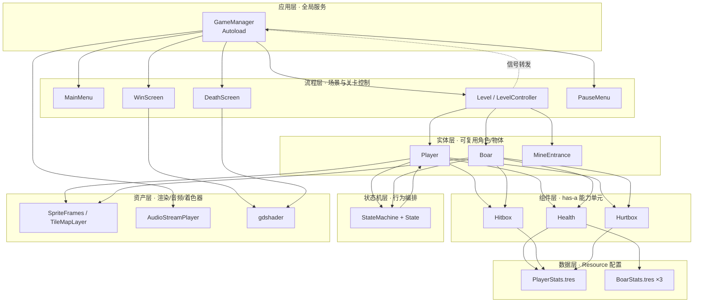
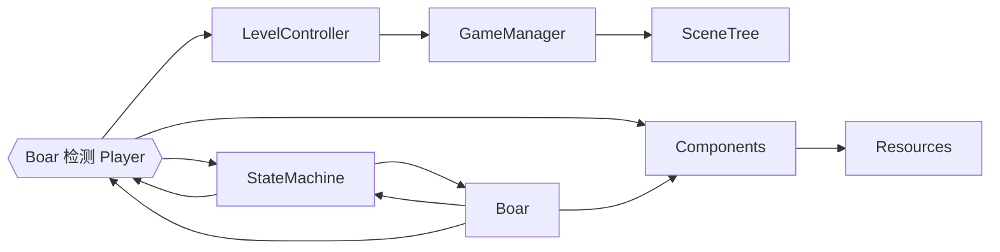
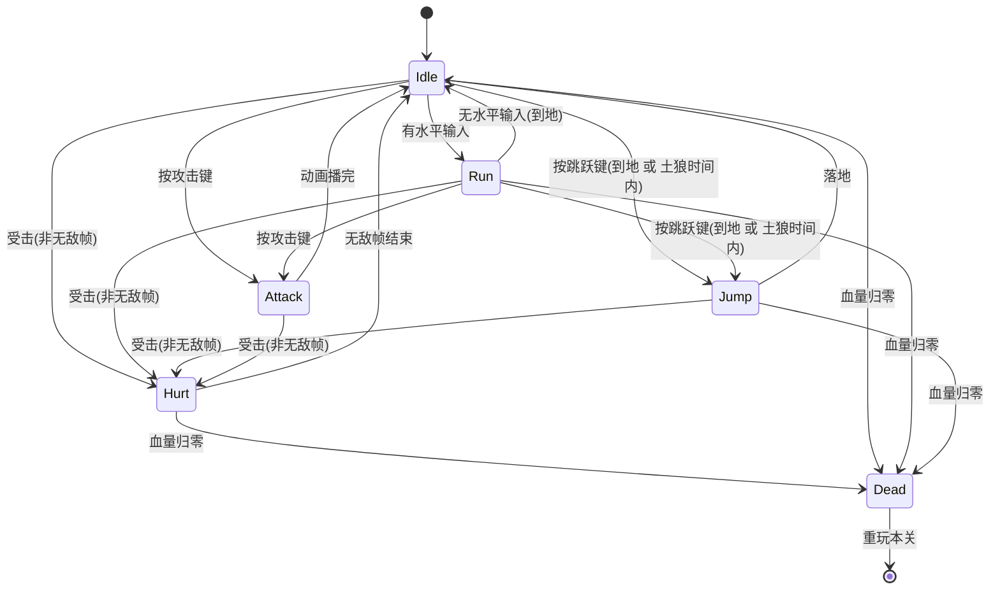
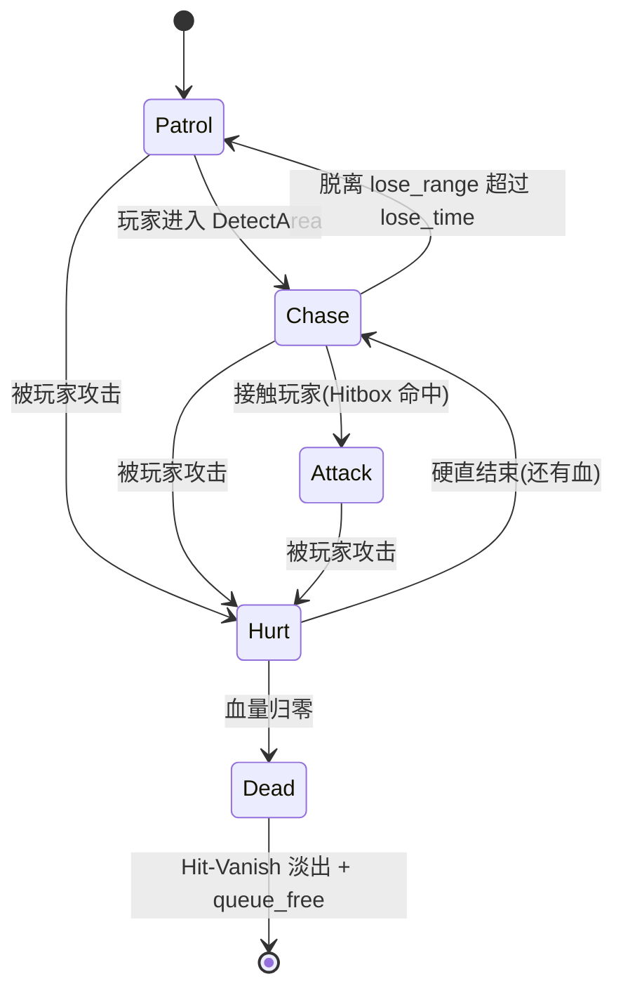
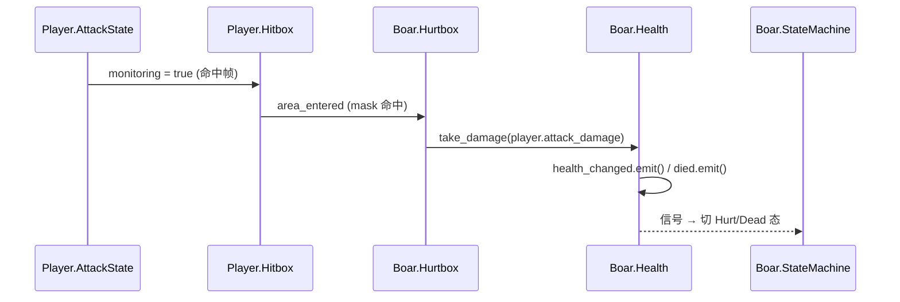
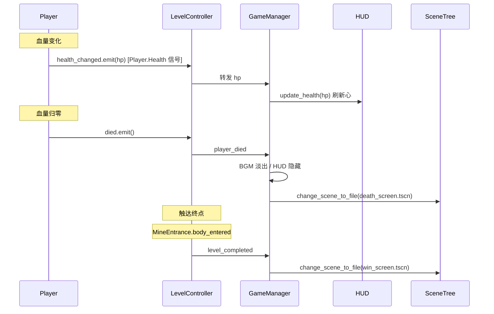
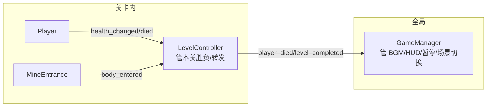

# 技术架构（MVP 全量）

> 文档定位：**MVP 阶段技术架构设计文档**，是 `scripts/` `scenes/` `assets/resources/` 实现的最高技术依据。
> 阶段：**MVP**（满足所有 `[P0]` 约束）。
> 上游依据：[核心玩法设计 GDD](../01_需求/01_核心玩法.md) §8（场景流与架构）、§4（主角）、§5（野猪）、§9（Shader）；[美术资产清单](../03_美术规范/01_美术资产清单.md) 附录 A（动画帧参数）。
> 本文件位于 `docs/`（已加 `.gdignore`，不参与 Godot 导入）。架构图/状态机/流程图遵从全局宪法 §3.3 用 **Mermaid** 绘制。
> 本文档**只设计不写代码**；编码实现交接至 `【Skill】godot-best-practices` / `godot-gdscript-patterns`。

---

## 目录

- [1. 架构总览](#1-架构总览)
- [2. 模块边界与依赖关系](#2-模块边界与依赖关系)
- [3. 场景树设计](#3-场景树设计)
- [4. 状态机架构](#4-状态机架构)
- [5. 组件系统](#5-组件系统)
- [6. 数据驱动 Resource](#6-数据驱动-resource)
- [7. 信号流设计](#7-信号流设计)
- [8. GameManager 职责边界](#8-gamemanager-职责边界)
- [9. Shader 方案](#9-shader-方案)
- [10. 输入系统](#10-输入系统)
- [11. 测试分层策略](#11-测试分层策略)
- [12. 目录结构](#12-目录结构)
- [13. 关键决策（ADR）](#13-关键决策adr)
- [14. 风险与技术债务](#14-风险与技术债务)
- [15. MVP 实现路线图](#15-mvp-实现路线图)
- [16. 与 GDD 一致性声明](#16-与-gdd-一致性声明)

---

## 1. 架构总览

### 1.1 分层架构



### 1.2 核心设计原则（遵从宪法）

| 原则 | 宪法出处 | 本架构落实 |
|---|---|---|
| 信号向上、调用向下 | §1.2 | 子实体发信号 → LevelController 转发 → GameManager |
| 组合优于继承 | §1.3 | Player/Boar 组合 Health/Hitbox/Hurtbox，无角色继承链 |
| 数据驱动 | §1.4 | 数值全走 `.tres`，代码零硬编码 |
| 场景自包含可复用 | §4.2 | Player/Boar 为独立子场景，可单独实例化测试 |
| Autoload 仅放全局服务 | §7.2 | GameManager 只管 BGM/HUD/暂停/场景调度，关卡逻辑归 LevelController |

---

## 2. 模块边界与依赖关系

### 2.1 模块清单

| 模块 | 类型 | 职责 | 禁止 |
|---|---|---|---|
| `GameManager` | Autoload | BGM 切换、HUD/PauseMenu 挂载与转发调用、暂停、场景调度、全局血量态 | ❌ 塞关卡胜负判定逻辑；❌ 承担 UI 分层（归各子场景根） |
| `HUD` | 独立子场景 CanvasLayer | 血量心显示与刷新 | ❌ 自行修改血量（被动接收 `update_health`） |
| `PauseMenu` | 独立子场景 CanvasLayer | 暂停遮罩、继续/重玩/返回按钮 | ❌ 自行执行场景切换（向上发信号交 GameManager） |
| `LevelController` | 场景内 Node | 接 Player/MineEntrance 信号、判定胜负、转发 GameManager | ❌ 直接操作 HUD/BGM |
| `Player` | 子场景 CharacterBody2D | 主角移动/跳跃/攻击/受击/死亡 | ❌ 反向调用 LevelController 方法 |
| `Boar` | 子场景 CharacterBody2D | 野猪巡逻/追击/冲撞/受击/死亡 | ❌ 知道 Player 类存在（用 group/detection 解耦） |
| `MineEntrance` | Area2D | 进入即发 `level_completed` | ❌ 内含胜负逻辑 |
| `Health` | 纯逻辑组件 Node | 血量数值、受伤/治愈、发信号 | ❌ 知道持有者类型 |
| `Hitbox` | 独立子场景 Area2D（hitbox.tscn） | 攻击方伤害区，命中帧激活 | ❌ 自行扣血（转发给对方 Hurtbox） |
| `Hurtbox` | 独立子场景 Area2D（hurtbox.tscn） | 受击判定区，转发伤害到同级 Health | ❌ 自行处理击退（归 HURT 状态） |

### 2.2 依赖方向（强制单向，禁止环依赖）



> **Boar 对 Player 的解耦**：Boar **不 import Player 类**。侦测靠 `Area2D.body_entered` + 玩家所在物理层/group 判定，追击靠检测到的 `body` 的 `global_position`。这样 Boar 可在无 Player 的测试场景独立运行。

---

## 3. 场景树设计

> 节点树骨架由 MCP 搭建（宪法 §12.1）；视觉属性初值由 AI 写入、用户在编辑器精调（§12.4）。命名遵从 [naming_conventions.md](../../.zcode/skills/godot-architect/references/naming_conventions.md)：场景脚本类名 = 场景文件名。

### 3.1 `game_manager.tscn`（Autoload 根，纯组合容器）

```
GameManager (CanvasLayer, layer=50, 全局常驻, process_mode=ALWAYS)
├── BgmPlayer (AudioStreamPlayer, bus=Music)        # 简单节点，保持内联
├── HUD (hud.tscn 实例)                              # 子场景根自带 CanvasLayer(layer=10)
└── PauseMenu (pause_menu.tscn 实例)                 # 子场景根自带 CanvasLayer(layer=100, WHEN_PAUSED)
└── 脚本: game_manager.gd (autoload, 禁 class_name)
```

> **组合方式**：HUD、PauseMenu 为**独立自包含子场景**（宪法 §4.2 + §1.3），分层与暂停行为内聚在各自场景根，GameManager 退化为纯组合容器（只挂载 + 转发），不承担 UI 分层职责。BgmPlayer 为单一节点，保持内联。

### 3.2 `hud.tscn`（HUD 子场景，自包含）

```
HUD (CanvasLayer, layer=10)  class_name HUD
├── MarginContainer (anchors=左上, margins)
│   └── HeartsBox (HBoxContainer)
│       └── Heart[0..4] (TextureRect × 5, AtlasTexture 亮/暗态)
└── 脚本: hud.gd
    - update_health(hp: int) → 按 hp 切换 Heart 的亮/暗 AtlasTexture
```

> 分层(layer=10)内聚在场景根，可脱离 GameManager 独立实例化测试（如临时挂到任意场景验证血量显示）。

### 3.3 `pause_menu.tscn`（暂停菜单子场景，自包含）

```
PauseMenu (CanvasLayer, layer=100, process_mode=WHEN_PAUSED, 初始 visible=false)  class_name PauseMenu
├── DimOverlay (ColorRect, 全屏半透明黑)
├── Panel (PanelContainer, 居中)
│   └── VBoxContainer
│       ├── TitleLabel ("已暂停")
│       └── ButtonGroup (VBoxContainer)
│           ├── ResumeButton ("继续")    # grab_focus 入口
│           ├── RetryButton ("重玩本关")
│           └── QuitButton ("返回标题")
└── 脚本: pause_menu.gd
    - 信号: resume_requested / retry_requested / quit_requested（按钮点击向上发）
    - open() / close() 控制显隐 + grab_focus
```

> 分层(layer=100)与暂停行为(WHEN_PAUSED)内聚在场景根，脱离 GameManager 仍可独立验证。按钮点击向上发信号（宪法 §1.2），由 GameManager 连接处理（继续/重玩/返回）。

### 3.4 `level.tscn`（关卡场景，瘦身）

```
Level (Node2D, y_sort_enabled=true)
├── ParallaxBackground
│   └── ParallaxLayer (motion_scale=0.2) → Sprite2D(Background.png)
├── TileMapLayer: BackgroundLayer (background.tres, 不碰撞)
├── TileMapLayer: GeometryLayer (geometry.tres, collision_layer=可碰撞地形)
├── TileMapLayer: GroundLayer (cave.tres, collision_layer=可碰撞地形)
├── Entities (Node2D, y_sort_enabled=true)
│   ├── Player (player.tscn 实例, 内含 Camera2D) @ 起点, %UniqueName
│   ├── BoarRoot (Node2D)
│   │   └── Boar × N (boar.tscn 实例, 各挂 boar_*.tres) @ 各段坐标
│   └── MineEntrance (Area2D, layer=触发区, mask=玩家) @ 终点
│       └── CollisionShape2D (RectShape2D 触发区)
├── TileMapLayer: ForegroundLayer (foreground.tres, 不碰撞, y_sort)
└── LevelController (Node, level_controller.gd)
```

> Camera2D 归 Player 内部（见 §3.5），关卡不再持有摄像机；相机跟随天然由父子节点位置继承实现。

### 3.5 `player.tscn`（主角子场景）

```
Player (CharacterBody2D)  class_name Player
├── Camera2D (跟随主角, enabled=true, 锚点=主角中心)   # 相机内聚于主角
├── AnimatedSprite2D (SpriteFrames: idle/run/attack/jump_start/jump_end/jump_all/dead)
├── BodyShape (CollisionShape2D, layer=玩家, mask=可碰撞地形)
├── StateMachine (Node)  class_name PlayerStateMachine
│   ├── IdleState / RunState / JumpState
│   ├── AttackState / HurtState / DeadState  (均为 State 子类)
├── Health (Node, health.gd)           # 纯逻辑组件，脚本挂载不抽场景
├── Hurtbox (hurtbox.tscn 实例, layer=受击区, mask=—)
└── Hitbox (hitbox.tscn 实例, layer=玩家攻击区, mask=受击区, monitoring=false)
└── 脚本: player.gd
```

> **Camera2D 放 Player 内的理由**：① 相机唯一职责是跟随主角，与主角强绑定，归主角更内聚（宪法 §1 三原则）；② Player 作为子场景自包含可复用，带相机即「实例化即可玩」；③ 跟随天然由父子位置继承，无需 level 持相机再 `@onready` 引用 Player，减少跨节点耦合。zoom/limit 等取景属性属宪法 §12.4 用户精调项。
>
> **Hitbox/Hurtbox 场景化**：二者为独立自包含子场景（见 §3.6/§3.7），Player/Boar 实例化时在 Inspector 配 `collision_layer`/`mask` 与 shape 尺寸（layer/mask 按阵营不同，shape 按体型不同，属 §12.4 精调项）。

### 3.6 `boar.tscn`（野猪子场景）

```
Boar (CharacterBody2D)  class_name Boar
├── AnimatedSprite2D (idle/walk/run/hit)
├── BodyShape (CollisionShape2D, layer=敌人, mask=可碰撞地形)
├── StateMachine (Node)
│   ├── PatrolState / ChaseState / AttackState
│   ├── HurtState / DeadState
├── Health (Node, health.gd)           # 纯逻辑组件，脚本挂载不抽场景
├── Hurtbox (hurtbox.tscn 实例, layer=受击区, mask=—)
├── Hitbox (hitbox.tscn 实例, layer=敌人攻击区, mask=受击区, monitoring 由 CHASE/ATTACK 态控制)
├── DetectArea (Area2D, layer=触发区, mask=玩家)  ← GDD §5.4 侦测圆
│   └── DetectShape (CollisionShape2D, CircleShape2D r=detect_range)
└── 脚本: boar.gd
```

### 3.7 `hitbox.tscn`（攻击伤害区组件场景，自包含）

```
Hitbox (Area2D)  class_name Hitbox
├── CollisionShape2D (内置, shape 默认 RectShape2D; 尺寸/偏移由宿主精调)
└── 脚本: hitbox.gd
    @export var damage: int = 0
    监听 area_entered → 命中对方 Hurtbox → 转发伤害
    命中帧由宿主 State 控制 monitoring 开关
```

> 场景根即 Area2D，CollisionShape2D 内置（组件自包含，可脱离宿主独立实例化测试）。宿主实例化后只需在 Inspector 调 `collision_layer`（按阵营）、`collision_mask`（按目标）、`monitoring`、shape 尺寸/偏移。

### 3.8 `hurtbox.tscn`（受击判定区组件场景，自包含）

```
Hurtbox (Area2D)  class_name Hurtbox
├── CollisionShape2D (内置, shape 默认 RectShape2D; 尺寸由宿主精调)
└── 脚本: hurtbox.gd
    被 hitbox 进入 → 转发伤害到同级 Health（@onready 引用）
```

> 与 Hitbox 同构（根 Area2D + 内置 CollisionShape2D + 脚本）。宿主配 `collision_layer=受击区`、`collision_mask` 留空（被动被检测）；shape 按体型精调。Player/Boar/Snail/Bee 等所有可受击实体统一复用此场景。

### 3.9 碰撞层规划（`project.godot` 物理层，中文名）

按实体单一语义拆分为 7 层（每层只承载一种实体/用途，层名一眼可读）。层名在 Godot 4.6 `Project → Project Settings → Layer Names → 2D Physics` 用**中文**配置，实际写入 `project.godot` 的 `[layer_names]` 段（ADR-11）。

| 层号 | 中文名 | 用途 | 典型持有者 |
|---|---|---|---|
| 1 | 玩家 | 玩家本体碰撞 | Player.BodyShape |
| 2 | 敌人 | 敌人本体碰撞 | Boar.BodyShape |
| 3 | 玩家攻击区 | 玩家挥剑伤害区 | Player.Hitbox |
| 4 | 敌人攻击区 | 敌人冲撞伤害区 | Boar.Hitbox |
| 5 | 受击区 | 受击判定（被动被检测） | Player/Boar/Snail/Bee 的 Hurtbox |
| 6 | 可碰撞地形 | 玩家/敌人行走的地面/树干 | Ground/Geometry TileMapLayer |
| 7 | 触发区 | 非伤害交互（终点、侦测） | MineEntrance / Boar.DetectArea |

**典型 mask 矩阵**（`collision_layer` = 自己是什么，`collision_mask` = 自己检测谁）：

| 节点 | layer | mask | 说明 |
|---|---|---|---|
| Player.BodyShape | 玩家(1) | 可碰撞地形(6) | 玩家踩地形；不与敌人直接物理碰撞（伤害走 hitbox/hurtbox） |
| Boar.BodyShape | 敌人(2) | 可碰撞地形(6) | 敌人踩地形 |
| Player.Hitbox | 玩家攻击区(3) | 受击区(5) | 玩家剑命中敌人受击区 |
| Boar.Hitbox | 敌人攻击区(4) | 受击区(5) | 敌人冲撞命中玩家受击区 |
| Player.Hurtbox | 受击区(5) | —（被动） | 被敌人攻击区(4)检测 |
| Boar.Hurtbox | 受击区(5) | —（被动） | 被玩家攻击区(3)检测 |
| Ground/Geometry TileMap | 可碰撞地形(6) | — | 提供碰撞面 |
| MineEntrance | 触发区(7) | 玩家(1) | 玩家进入即过关 |
| Boar.DetectArea | 触发区(7) | 玩家(1) | 侦测玩家进入即追击 |

> **设计要点**：身体层（1/2）与攻击/受击层（3/4/5）分离，避免「身体撞身体」触发伤害——伤害只能通过 hitbox→hurtbox 这条明确链路。触发区(7)与伤害链路完全隔离，确保侦测/过关不会误触受击。

---

## 4. 状态机架构

### 4.1 选型决策（见 ADR-1）

采用**节点状态机模式**（宪法 §7.1 复杂状态推荐）：`StateMachine`(Node) + 多个 `State`(Node 子类) 作为 StateMachine 静态子节点。状态切换**仅改 `current_state` 指针并调 `enter()/exit()`**，不做 `queue_free()` / 重建（区别于 `godot-architect` 的 state-machine-guide 模板，见 §13.2）。

### 4.2 状态机基类接口

```gdscript
# state.gd（基类，class_name State）
class_name State
extends Node

# 信号：请求切换状态（类型化，遵宪法 §5.1）
signal transition_requested(to_state: StringName)

var machine: StateMachine         # 宿主状态机（_ready 由父注入或 @onready）
var host: Node                    # 持有者（Player/Boar 的 CharacterBody2D）

func enter(_msg: Dictionary = {}) -> void: pass
func exit() -> void: pass
func process(_delta: float) -> void: pass
func physics_process(_delta: float) -> void: pass
func handle_input(_event: InputEvent) -> void: pass
```

```gdscript
# state_machine.gd（基类，class_name StateMachine）
class_name StateMachine
extends Node

@export var initial_state: State
var current_state: State
var states: Dictionary[StringName, State] = {}  # name → State 节点

func _ready() -> void:
    for child in get_children():
        if child is State:
            states[child.name] = child          # name 作 StringName key
            child.machine = self
            child.host = get_parent()           # StateMachine 的父 = 宿主实体
    current_state = initial_state
    current_state.enter()

func transition_to(to_state: StringName, msg: Dictionary = {}) -> void:
    if not states.has(to_state): return
    current_state.exit()
    current_state = states[to_state]
    current_state.enter(msg)
```

### 4.3 Player 状态机



> **手感优化（ADR-12）**：跳跃支持**土狼时间（Coyote Time）** + **跳跃缓冲（Jump Buffer）**——离开平台边缘后 `coyote_time` 内仍可起跳；落地前 `jump_buffer_time` 内按过跳跃键则落地瞬间自动起跳。两者均提升横版手感宽容度。

| 状态 | 职责 | 关键逻辑 |
|---|---|---|
| `IdleState` | 静止，播 idle 循环 | 监听 move/jump/attack 输入；着地刷新 `last_grounded_time` |
| `RunState` | 水平移动，播 run 循环 | 加速度/摩擦力模型改 `velocity.x`；`flip_h` 同步；着地刷新 `last_grounded_time` |
| `JumpState` | 起跳/滞空/落地 | 初速度 `jump_velocity`；variable jump（松键上升速度 ×0.5）；落地转 Idle；落地时消费 `jump_buffer` 提前起跳 |
| `AttackState` | 挥剑，播 attack 非循环 | 攻击冷却计时；命中帧（5~7）激活 Hitbox.monitoring；播完转 Idle；着地刷新 `last_grounded_time` |
| `HurtState` | 受击，闪烁+无敌帧 | 击退力施加并衰减；`invincible_duration` 计时；用 idle 帧闪烁临时代替 hurt 动画（ADR-6） |
| `DeadState` | 死亡，播 dead 非循环 | 播完发 `died` 信号 → GameManager 切 death_screen |

> **跳跃判定时机（所有地面态共用，逻辑放 Player 主脚本）**：
> - **土狼时间**：着地时 `last_grounded_time = now`；按跳跃键时检查 `now - last_grounded_time ≤ coyote_time` 成立即允许起跳（即使已短暂离地）。
> - **跳跃缓冲**：按跳跃键时 `last_jump_press_time = now`；落地瞬间检查 `now - last_jump_press_time ≤ jump_buffer_time` 成立即自动起跳。
> - 两个时间戳在 Player 主脚本维护，各 State 通过 `host` 读写，避免重复实现。

### 4.4 Boar 状态机



| 状态 | 职责 | 关键逻辑 |
|---|---|---|
| `PatrolState` | 范围内左右巡逻，播 walk/idle | 巡逻锚点边界；速度 `patrol_speed` |
| `ChaseState` | 朝玩家冲撞，播 run | 速度 `chase_speed`；激活 Hitbox；脱战计时器 |
| `AttackState` | 冲撞命中（MVP 与 Chase 合并，靠 Hitbox 接触判定） | Hitbox 进入玩家 Hurtbox → 接触伤害 |
| `HurtState` | 受击硬直，播 hit | `hurt_stun` 计时；击退衰减 |
| `DeadState` | 播 hit 动画 + 淡出 | `modulate.a` Tween → queue_free |

---

## 5. 组件系统

> 遵从宪法 §5.2 has-a 组件。组件**不知持有者类型**，通过信号向上通信、通过 `get_parent()` 或 `@onready` 引用同级组件。
>
> **场景化原则（ADR-10）**：含 `Area2D` + 碰撞配置的组件（Hitbox/Hurtbox）抽为**独立自包含 `.tscn`**（根=Area2D + 内置 CollisionShape2D + 脚本），便于跨实体复用与独立测试；纯逻辑组件（Health）保持 `.gd` 脚本挂载，不抽场景。

### 5.1 Health

```gdscript
class_name Health
extends Node

signal health_changed(new_hp: int)
signal died

@export var stats: StatsResource          # PlayerStats 或 BoarStats（多态引用基类）
var current_health: int = 0
var is_dead: bool = false

func _ready() -> void:
    current_health = stats.max_health

func take_damage(amount: int) -> void:
    if is_dead: return
    current_health = max(current_health - amount, 0)
    health_changed.emit(current_health)
    if current_health <= 0:
        is_dead = true
        died.emit()
```

### 5.2 Hitbox / Hurtbox

| 组件 | 角色 | collision_layer | collision_mask | 触发 |
|---|---|---|---|---|
| Hitbox（玩家） | 攻击方伤害区 | 玩家攻击区 | 受击区 | `area_entered` → 调对方 hurtbox → health.take_damage |
| Hitbox（敌人） | 攻击方伤害区 | 敌人攻击区 | 受击区 | 同上 |
| Hurtbox | 受击判定区 | 受击区 | —（被动被检测） | 被 hitbox 进入 → 转发给同级 Health |



> **击退不在组件内处理**：take_damage 只改血量并发信号；击退是状态行为，由宿主切换到 HurtState 在 `physics_process` 施加并衰减（ADR-3）。

### 5.3 命中帧激活（Attack 时序）

```
attack 动画 12 帧 @ 15fps（≈0.8s）：
帧:  1  2  3  4  5  6  7  8  9 10 11 12
起手 ──────── 挥击 ▓▓▓ ──── 收招
                ↑ 命中框仅帧 5~7 激活

实现：AnimatedSprite2D.frame_changed 信号 → AttackState 监听 →
      frame in [5,7] ? hitbox.monitoring=true : false
```

---

## 6. 数据驱动 Resource

### 6.1 Resource 类与实例

```gdscript
# scripts/resources/stats_resource.gd（基类，提供阵营与血量）
class_name StatsResource
extends Resource

@export var max_health: int = 100
```

```gdscript
# scripts/resources/player_stats.gd
class_name PlayerStats
extends StatsResource

@export_group("Movement")
@export var move_speed: float = 160.0
@export var acceleration: float = 1200.0
@export var friction: float = 1200.0
@export var jump_velocity: float = -280.0
@export var variable_jump_multiplier: float = 0.5

@export_group("Jump Feel")   # 手感宽容度（ADR-12）
@export var coyote_time: float = 0.10          # 离开边缘后仍可起跳的宽限期(秒)
@export var jump_buffer_time: float = 0.10     # 落地前按跳跃键的缓冲期(秒)，落地自动起跳

@export_group("Combat")
@export var attack_damage: int = 15
@export var attack_cooldown: float = 0.45
@export var invincible_duration: float = 1.0
@export var knockback: float = 150.0
```

```gdscript
# scripts/resources/boar_stats.gd
class_name BoarStats
extends StatsResource

@export var contact_damage: int = 20
@export var patrol_speed: float = 40.0
@export var chase_speed: float = 120.0
@export var detect_range: float = 120.0
@export var lose_range: float = 240.0
@export var lose_time: float = 2.0
@export var hurt_stun: float = 0.3
@export var knockback: float = 120.0
@export var despawn_time: float = 0.4
```

### 6.2 三段难度实例（GDD §5.3）

| 实例文件 | max_health | chase_speed | detect_range | 用途 |
|---|---|---|---|---|
| `boar_tame.tres` | 30 | 80 | 80 | 段① 林缘 |
| `boar_normal.tres` | 30 | 120 | 120 | 段② 密林 |
| `boar_aggressive.tres` | 30 | 140 | 160 | 段③ 突围 |

实例存放 `assets/resources/stats/`。

### 6.3 重力处理（ADR-2）

**重力 `900 px/s²` 不放 PlayerStats，改由 `ProjectSettings` 的 `physics/2d/default_gravity` 全局配置**，所有 CharacterBody2D 统一读取。理由：重力是全局物理常量，每角色重复配置易不一致；PlayerStats 保持"角色专属参数"高内聚。

> ⚠️ 此为对 GDD §4.2 的偏差，见 §16 一致性声明。

---

## 7. 信号流设计

### 7.1 MVP 信号链（GDD §8.5：直接调 GameManager，不用 EventBus）



### 7.2 信号清单

| 信号源 | 信号 | 接收方 |
|---|---|---|
| `Health` | `health_changed(new_hp: int)` | 宿主状态机（切 Hurt/Dead）、LevelController |
| `Health` | `died` | 宿主状态机（切 Dead）、LevelController |
| `MineEntrance` | `body_entered` | LevelController → 判定胜负 |
| `PauseMenu` | `resume_requested` / `retry_requested` / `quit_requested` | GameManager（继续/重玩/返回标题） |
| `Boar.DetectArea` | `body_entered` / `body_exited` | Boar.StateMachine（Patrol↔Chase） |
| `AnimatedSprite2D` | `frame_changed` | AttackState（命中帧激活 Hitbox） |
| `AnimatedSprite2D` | `animation_finished` | 各 State（播完转 Idle） |

> 全部信号用类型化 `.emit()` / `.connect()`，禁止字符串形式（宪法 §5.1）。

---

## 8. GameManager 职责边界

### 8.1 允许（全局服务）

| 职责 | 实现 |
|---|---|
| BGM 播放/无缝切换 | 持 AudioStreamPlayer，按场景 Tween 交叉淡出（GDD §8.6） |
| HUD 控制 | 持 hud.tscn 实例，调 `hud.update_health()` 刷新（分层由 hud.tscn 自带 CanvasLayer 承担，非 GameManager 职责） |
| 暂停 | `get_tree().paused = true`；PauseMenu 为独立场景，其 WHEN_PAUSED 行为已内聚，GameManager 仅调 `pause_menu.open()/close()` |
| 场景调度 | `change_scene_to_file()` 切 MainMenu/Level/Win/Death |
| 全局血量态 | 供重玩时重置 Player 血量 |

### 8.2 禁止（关卡逻辑下沉）

- ❌ 胜负判定 → 归 `LevelController`
- ❌ 野猪生成/刷新 → 归关卡（MVP 静态放置，无动态刷新）
- ❌ 摄像机控制 → 归 Player 内部的 Camera2D（见 §3.5 ADR-9）

### 8.3 与 LevelController 的分工



---

## 9. Shader 方案

> GDD §9 定义两个从零手写 shader。MVP 简化为「全屏 ColorRect + canvas_item shader」，非后处理全屏抓帧（避免复杂 BackBufferCopy）。

### 9.1 胜利 `win_glow.gdshader`

| 效果 | 实现 |
|---|---|
| 泛光 | 提取亮部 → 高斯模糊 → 叠加（用 SCREEN_TEXTURE + 多次偏移采样近似） |
| 金色光波 | `TIME` 驱动、以屏幕中心为圆心的扩张圆环，环内金色 `modulate` 叠加 |

uniform：`time`(用 `TIME`)、`wave_intensity`、`bloom_threshold`。

### 9.2 死亡 `death_shatter.gdshader`

| 效果 | 实现 |
|---|---|
| 碎裂 | `noise.tres`(FastNoiseLite) 驱动 UV 偏移，画面撕裂成块向外扩散 |
| 灰度 | RGB 转 luma，向暗压缩 |

uniform：`crack_intensity`(0→1)、`shake_amount`。

### 9.3 资产清单

| 文件 | 类型 |
|---|---|
| `assets/shaders/win_glow.gdshader` | canvas_item |
| `assets/shaders/death_shatter.gdshader` | canvas_item |
| `assets/shaders/noise.tres` | NoiseTexture2D (FastNoiseLite) |

> Shader 非场景文件可手写，但接入后须在编辑器预览 + 玩家手工试玩验证（宪法 §12.5）。门禁 §10 表无独立 shader lint 项，按 GDD §9.3 走编辑器验证。

---

## 10. 输入系统

遵从 GDD §6。在 `Project → Project Settings → Input Map` 定义 5 个 action（`move_left`/`move_right`/`jump`/`attack`/`pause`），键盘 + 手柄同绑。代码用 `Input.get_vector()`、`Input.is_action_pressed()`，无硬编码键位。

> `pause` action 在 GameManager 的 `_unhandled_input` 捕获（跨场景），不归关卡。

---

## 11. 测试分层策略

遵从宪法 §9。GdUnit4 框架，`test/{unit,integration,functional}/`。

| 层 | 目录 | 覆盖目标（MVP 关键路径） |
|---|---|---|
| **unit** | `test/unit/` | `Health`：take_damage/heal、0 血边界、died 信号触发；`PlayerStats`/`BoarStats` 数值边界；各 State 的 `can_transition` / enter 退出逻辑（注入 mock 输入） |
| **integration** | `test/integration/player/` | Player+StateMachine+Health+Hurtbox 协作：受击→HURT 态→无敌帧→回 Idle；Attack 命中帧激活 Hitbox |
| **integration** | `test/integration/enemy/` | Boar DetectArea 触发 CHASE；脱战 `lose_time` 回 PATROL；被命中→HURT→Dead 淡出 queue_free |
| **integration** | `test/integration/level/` | Player.Hitbox 命中 Boar.Hurtbox→扣血击退；MineEntrance 触发 `level_completed`；Player.died 触发切 death_screen |
| **functional** | `test/functional/` | 端到端脚本化输入试玩 + 截图（关卡通关流、死亡重试流） |

> MVP 覆盖关键逻辑路径（宪法 §9.4 P0）；G11 ≥80% 为 P1 正式开发目标。浮点比较用 `assert_almost_eq`，节点用 `add_child_autoqfree` 自动清理（宪法 §9.2）。

---

## 12. 目录结构

```
res://
├── scenes/
│   ├── game_manager.tscn
│   ├── main_menu.tscn
│   ├── level.tscn
│   ├── pause_menu.tscn
│   ├── win_screen.tscn
│   ├── death_screen.tscn
│   ├── player.tscn
│   ├── boar.tscn
│   ├── hud.tscn
│   ├── pause_menu.tscn
│   ├── hitbox.tscn                            # 组件场景（复用）
│   └── hurtbox.tscn                           # 组件场景（复用）
├── scripts/
│   ├── autoload/
│   │   └── game_manager.gd                 # autoload, 禁 class_name
│   ├── shared/
│   │   ├── state.gd                        # class_name State
│   │   └── state_machine.gd                # class_name StateMachine
│   ├── components/
│   │   ├── health.gd
│   │   ├── hitbox.gd
│   │   └── hurtbox.gd
│   ├── player/
│   │   ├── player.gd                       # class_name Player
│   │   └── states/
│   │       ├── idle_state.gd  run_state.gd  jump_state.gd
│   │       ├── attack_state.gd  hurt_state.gd  dead_state.gd
│   ├── enemy/
│   │   ├── boar.gd                         # class_name Boar
│   │   └── states/
│   │       ├── patrol_state.gd  chase_state.gd  attack_state.gd
│   │       └── hurt_state.gd  dead_state.gd
│   ├── level/
│   │   ├── level_controller.gd             # class_name LevelController
│   │   └── mine_entrance.gd                # class_name MineEntrance
│   ├── ui/
│   │   ├── hud.gd  main_menu.gd  pause_menu.gd
│   │   ├── win_screen.gd  death_screen.gd
│   └── resources/
│       ├── stats_resource.gd               # class_name StatsResource (基类)
│       ├── player_stats.gd                 # class_name PlayerStats
│       └── boar_stats.gd                   # class_name BoarStats
├── assets/
│   ├── resources/stats/                    # .tres 实例
│   │   ├── player_stats.tres
│   │   └── boar_{tame,normal,aggressive}.tres
│   ├── shaders/                            # 新建
│   │   ├── win_glow.gdshader  death_shatter.gdshader  noise.tres
│   ├── sprites/ music/ sounds/ fonts/ themes/ bus/
│   └── (现有 tileset/texture 资源)
├── test/
│   ├── unit/  integration/{player,enemy,level}/  functional/
├── addons/gdUnit4/
└── docs/
```

---

## 13. 关键决策（ADR）

### ADR-1 状态机选节点模式，并对 Skill 模板裁剪

**背景**：`godot-architect` 的 state-machine-guide 提供了 StateFactory + StateData + 动态 queue_free 的完整模板。
**决策**：采用节点状态机模式（StateMachine + 静态 State 子节点），但**裁剪掉 StateData/StateFactory**，切换仅改 `current_state` 指针 + 调 `enter/exit`，不 `queue_free` 重建。
**理由**：① MVP 主角 6 态、野猪 5 态，StateData/Factory 属过度设计；② 动态 queue_free 状态节点有性能开销与信号断连复杂度；③ Skill 模板多处用 `emit_signal("x")` 字符串、`!= null` 判节点，**违反项目宪法 §5.1 / §4.2**，需修正为类型化信号 + `is_instance_valid`。
**后果**：状态节点常驻场景树（内存占用小且固定），状态间数据通过 `host`（StateMachine.get_parent()）共享访问。

### ADR-2 重力移至 ProjectSettings，不放 PlayerStats

**背景**：GDD §4.2 将 `gravity=900` 列于 PlayerStats。
**决策**：改由 `ProjectSettings.physics/2d/default_gravity` 全局配置。
**理由**：重力是全局物理常量，所有 CharacterBody2D 共用；放 Resource 易多角色不一致。
**后果**：PlayerStats 不含 gravity（见 §6.1）；GDD §4.2 需同步更新（见 §16）。

### ADR-3 击退作为状态行为，不进组件

**背景**：击退需在受击后短暂位移。
**决策**：take_damage 只改血量发信号；击退由 HurtState 在 `physics_process` 施加并衰减。
**理由**：保持 Health 单一职责（只管血量）；击退是行为，归状态机。
**后果**：HurtState 需读 `stats.knockback`。

### ADR-4 Boar 与 Player 解耦，不 import 对方类

**背景**：Boar 需追击 Player。
**决策**：Boar 用 `DetectArea.body_entered` + 物理层/group 判定，追击读 `body.global_position`，不 import Player。
**理由**：Boar 可在无 Player 的测试场景独立运行（宪法 §4.2 可复用可实例化）。
**后果**：Boar 对 Player 无编译期依赖。

### ADR-5 HUD/PauseMenu 作为 GameManager 子节点常驻

**背景**：GDD §8.2 要求 BGM/HUD/Pause 跨场景常驻。
**决策**：三者作为 `game_manager.tscn`（Autoload）子节点。
**理由**：场景切换不重建 UI，真正无缝（GDD §8.6）。
**后果**：HUD 更新走 GameManager.update_health()，LevelController 不直接碰 HUD。

### ADR-6 主角无 Hurt 动画，用 idle 闪烁临时代替

**背景**：美术资产清单 §12.1 确认主角无独立 Hurt 动画。
**决策**：HurtState 用 idle 帧 + `modulate.a` 闪烁（拉锯透明度）临时代替。
**理由**：GDD §4.3/§11 已认可 MVP 临时代替。
**后果**：正式开发需补 hurt 动画或更换资产。

### ADR-7 Shader 用全屏 ColorRect，非后处理抓帧

**背景**：胜利泛光/死亡碎裂需处理"整个画面"。
**决策**：用全屏 ColorRect + canvas_item shader 对自身做效果（不做 SCREEN_TEXTURE 后处理抓帧）。
**理由**：MVP 简化，避免 BackBufferCopy 复杂度；胜利/死亡画面本就是独立全屏场景，覆盖 ColorRect 即可。
**后果**：shader 作用于遮罩层而非实时游戏画面；死亡碎裂效果作用于死亡场景背景（非实时死亡瞬间游戏画面）。

### ADR-8 HUD/PauseMenu 抽为独立自包含场景

**背景**：GDD §8.2 将 HUD/PauseMenu 描述为 GameManager 内的 CanvasLayer 子节点。
**决策**：把 HUD、PauseMenu 各抽为独立 `.tscn`，**子场景根节点自带 CanvasLayer**（hud.tscn 根 layer=10；pause_menu.tscn 根 layer=100 + process_mode=WHEN_PAUSED）；GameManager 退化为纯组合容器（挂载 + 转发），不承担 UI 分层职责。BgmPlayer 为单一节点保持内联。
**理由**：① 宪法 §4.2 场景自包含可复用、§1.3 组合优于继承——分层与暂停行为内聚在各自场景根，HUD/PauseMenu 可脱离 GameManager 独立实例化测试；② GameManager 保持单一职责（全局服务调度），避免 UI 分层逻辑混入。
**后果**：`scenes/` 新增 `hud.tscn` / `pause_menu.tscn`（§12 目录树已含）；GameManager 通过 `@onready var hud: HUD = $HUD` 引用并转发调用。

### ADR-9 Camera2D 归 Player 内部，不放 level.tscn

**背景**：GDD §8.4 将 Camera2D 列为 level.tscn 的子节点，靠 `@onready` 引用 Player 跟随。
**决策**：Camera2D 作为 `player.tscn` 的直接子节点，level.tscn 不再持有相机。
**理由**：① 相机唯一职责是跟随主角，与主角强绑定，归主角更内聚（宪法 §1 三原则）；② Player 自包含可复用——带相机即「实例化即可玩」，符合 §4.2；③ 跟随由父子节点位置继承天然实现，无需跨节点引用，减少耦合。
**后果**：level.tscn 节点树减少一个跨层引用；Camera2D 的 zoom/limit 等取景属性属宪法 §12.4 用户精调项，在 player.tscn 编辑器精调。

### ADR-10 Hitbox/Hurtbox 抽为独立自包含场景，Health 保持纯脚本

**背景**：原 §3.5/§3.6 将 Hitbox/Hurtbox 作为 Player/Boar 内联 Area2D 节点。
**决策**：Hitbox/Hurtbox 各抽为独立 `.tscn`（根=Area2D + 内置 CollisionShape2D + 脚本）；Health 保持纯 `.gd` 脚本挂载，不抽场景。
**理由**：① Hitbox/Hurtbox 是「Area2D+碰撞配置+脚本」的完整组合，含可复用的碰撞/伤害配置，跨 Player/Boar/Snail/Bee 等所有可受击实体复用，场景化后可独立实例化测试（宪法 §4.2）；② Health 是纯逻辑 Node（无 Area2D、无 CollisionShape2D、无可复用的视觉/碰撞属性），抽场景无增量价值，保持 `.gd` 挂载更轻量；③ 与 ADR-8（HUD/PauseMenu 场景化）形成一致的"组合单元即场景"原则。
**后果**：`scenes/` 新增 `hitbox.tscn` / `hurtbox.tscn`（§12 目录树已补）；宿主实例化后在 Inspector 配 `collision_layer`/`mask`（按阵营）、shape 尺寸/偏移（按体型，§12.4 精调项）。

### ADR-11 碰撞层用中文名，按实体单一语义拆 7 层

**背景**：原 §3.9 用英文混用层（layer_1=player+terrain、layer_2=enemy+enemy_hitbox），层名无法精确表达混用语义，且 project.godot 未配置任何 2D 层名。
**决策**：① 在 `project.godot` 的 `[layer_names]` 段用**中文**配置 7 个 2D 物理层（玩家/敌人/玩家攻击区/敌人攻击区/受击区/可碰撞地形/触发区），每层单一语义；② 身体层与攻击/受击层分离，伤害只能走 hitbox→hurtbox 链路；③ 触发区与伤害链路隔离。
**理由**：① 中文层名一眼可读，Inspector 配置时降低心智负担（遵从用户「中文编排」要求）；② 单一语义避免混用层命名歧义（原 layer_1 同时是玩家和地形，层名无法兼顾）；③ 身体/攻击分离杜绝「身体撞身体误触伤害」。
**后果**：M1 实现阶段用编辑器/MCP 写入 `project.godot`（本架构阶段仅约定，不提前改文件）；所有场景的 layer/mask 在文档中用中文名标注，实际配置时勾选对应中文层。

### ADR-12 跳跃手感：土狼时间 + 跳跃缓冲

**背景**：GDD §4.1 跳跃为严格"到地才能起跳"，离地即无法起跳、落地瞬间按键易丢失，横版手感生硬。用户要求支持土狼时间提升手感。
**决策**：Player 跳跃加入两项标准手感优化——① **土狼时间（Coyote Time）**：着地刷新 `last_grounded_time`，离地后 `coyote_time` 内按跳跃键仍可起跳；② **跳跃缓冲（Jump Buffer）**：按跳跃键记录 `last_jump_press_time`，落地瞬间若在 `jump_buffer_time` 内则自动起跳。两参数走 `PlayerStats.Jump Feel` 组（数据驱动，§6.1）。
**理由**：① 业界横版动作标配，显著降低"踩空没跳起来"和"落地没接上跳"的挫败感；② 数据驱动可试玩微调；③ 时间戳统一放 Player 主脚本，各地面态通过 `host` 共享，避免重复实现。
**后果**：PlayerStats 新增 `coyote_time`/`jump_buffer_time` 两参数（默认均 0.10s）；状态图 Idle/Run→Jump 条件放宽；手感属宪法 §12.4/§12.5 用户精调与试玩验证项。

### ADR-13 组件类名/文件名不加 Component 后缀

**背景**：原设计沿用 `HitboxComponent`/`HurtboxComponent`/`HealthComponent` 命名。
**决策**：去掉 `Component` 后缀，类名/文件名/场景名统一为 `Hitbox`/`Hurtbox`/`Health`（`hitbox.gd`/`hurtbox.gd`/`health.gd`，`hitbox.tscn`/`hurtbox.tscn`）。
**理由**：遵从 naming_conventions.md「能不加后缀就别加」——组件本质靠 has-a 组合体现（宪法 §5.2），无需靠类名后缀标注；后缀冗余且增加调用处噪音。
**后果**：全文类名/节点名/脚本名/场景名/章节标题已同步；代码实现时按无后缀命名。

---

## 14. 风险与技术债务

### 14.1 接入前需清理的债务（[P0]）

| 债务 | 来源 | 处理 | 归属阶段 |
|---|---|---|---|
| `bus.tres` 的 `New Bus 2` 未命名 | 美术清单 §12.1 | 重命名为 `Music`，BGM 走此 bus | 接入 BGM 前 |
| `cave.tres` 命名/路径混乱 | 美术清单 §12.1 | 架构引用统一用，资产改名列为债务（避免改 UID） | 架构层用现路径 |
| 主角无 Hurt 动画 | 美术清单 §12.1 | ADR-6 闪烁代替 | MVP 临时代替 |
| `SmileySans` 字体冗余 `.ttf` | 美术清单 §12.2 | 删未引用 `.ttf` | 发布前 |
| Debug Map 进包体 | 美术清单 §12.2 | `Legac-Fantasy_Debug_Map/` 加 `.gdignore` | 发布前 |

### 14.2 技术风险

| 风险 | 概率 | 影响 | 缓解 |
|---|---|---|---|
| 帧尺寸不一致（80px vs 64px）导致跳跃角色"跳位" | 中 | 中 | AnimatedSprite 脚底中心对齐；碰撞框固定锚点（见美术清单 §4.1） |
| 2D 物理是否受 Jolt 影响 | 低 | 低 | Jolt 仅 3D；2D 用 Godot 默认。文档已注明 |
| Shader 首次手写出 bug | 中 | 中 | 编辑器预览 + 玩家手工试玩验证（§12.5） |
| 状态切换时序（如攻击中被击）竞态 | 中 | 中 | HURT 态可中断 ATTACK（状态机图已含 Attack→Hurt）；命中帧关闭靠 animation_finished 兜底 |
| HUD 跨场景常驻 vs 关卡重置血量同步 | 中 | 中 | GameManager 持全局血量态，重玩时主动 reset（§8.1） |

---

## 15. MVP 实现路线图

### 15.1 拆分原则（强制约束）

每个里程碑必须同时满足：

1. **开发时长 ≤ 10min**（净开发量：搭场景骨架 + TDD 单测 + 最小实现，不含跨里程碑的固定质量仪式）。
2. **F5 即可玩**：里程碑完成后必须能运行并产生**可感知的增量体验**（新操作 / 新视觉 / 新交互 / 新目标；纯重构里程碑须保持原有可玩性不退化）。
3. **单一职责**：一次只动一件事。
4. **占位优先**：能用简单形状（灰方块/彩方块）快速闭环的，先用占位，后续里程碑逐步替换为真实精灵，避免单步因资产配置超时。

> 每个里程碑仍走宪法 §12.7 工作流：TDD 小循环 → MCP 诊断/lint → 编辑器重载 → 玩家手工验证（§12.5）→ 提交 → 经验沉淀。涉及可见节点时插入 §12.4 可视化搭建关卡。"≤10min"指里程碑本身的开发量，质量门禁为每里程碑固定流程。

### 15.2 里程碑清单（26 个，8 阶段）

图例：🎮=新操作  👁=新视觉  ⚔=新战斗交互  🤖=新敌人行为  🎯=新目标/流程  🔧=重构  ✨=特效

#### 阶段 A · 移动基石（占位）

| # | 里程碑 | 交付物 | 可玩验证 | AC |
|---|---|---|---|---|
| M1 | 🎮 灰方块左右移动 | `player.tscn`(CharacterBody2D+ColorRect+BodyShape) + `level.tscn`(静态地面) + `player.gd`(velocity.x+move_and_slide) + move_left/right input | F5：灰方块在地面左右移动 | AC3/AC4 |
| M2 | 🎮 重力+跳跃 | gravity(读 ProjectSettings) + jump_velocity + is_on_floor + jump input | F5：按 Space 起跳落地 | AC3 |

#### 阶段 B · 主角填皮

| # | 里程碑 | 交付物 | 可玩验证 | AC |
|---|---|---|---|---|
| M3 | 👁 勇士 idle+run 动画 | ColorRect→AnimatedSprite2D；建 SpriteFrames 配 idle(hframes=4)+run(hframes=10)；按 velocity 选动画 + flip_h | F5：看到勇士，移动时跑动、停下呼吸 | — |
| M4 | 👁 跳跃动画 | SpriteFrames 配 jump(Jump-All 表 hframes=15)；跳跃时切动画 | F5：跳跃有起跳/滞空/落地动画 | — |

#### 阶段 C · 状态机重构 + 手感

| # | 里程碑 | 交付物 | 可玩验证 | AC |
|---|---|---|---|---|
| M5 | 🔧 散装逻辑→状态机 | StateMachine + State 基类 + IdleState/RunState/JumpState；动画选择逻辑迁入各 State | F5：行为同 M4（重构，不退化） | — |
| M6 | 🎮 土狼时间+跳跃缓冲 | PlayerStats 加 coyote_time/jump_buffer_time；last_grounded_time/last_jump_press_time 时间戳 + 判定 | F5：离地短暂仍能跳、落地接跳更顺 | — |

#### 阶段 D · 战斗（主角）

| # | 里程碑 | 交付物 | 可玩验证 | AC |
|---|---|---|---|---|
| M7 | 🎮 攻击键+AttackState | attack input + AttackState + attack 动画(hframes=12)；播完转 Idle | F5：按 J 挥剑（暂无命中） | AC3 |
| M8 | ⚔ hitbox+命中帧+静态靶 | `hitbox.tscn`/`hurtbox.tscn` 组件场景；AttackState 命中帧(5~7)激活 Hitbox；静态靶(方块+Health+hurtbox)；击中扣血 | F5：挥剑命中方块，方块血量减少 | — |

#### 阶段 E · 野猪 AI

| # | 里程碑 | 交付物 | 可玩验证 | AC |
|---|---|---|---|---|
| M9 | 🤖 野猪占位+巡逻 | `boar.tscn`(方块+BodyShape+StateMachine) + PatrolState + 巡逻边界 | F5：方块野猪左右游荡 | — |
| M10 | 👁 野猪填皮 | AnimatedSprite2D 配 idle(hframes=6)+walk(hframes=9)；Patrol 态播 walk | F5：看到野猪走动 | — |
| M11 | 🤖 ChaseState+追击 | DetectArea(触发区层) + ChaseState + chase_speed 追玩家位置 | F5：靠近野猪被追击 | AC6 |
| M12 | ⚔ 玩家受击 | Player.HurtState + 无敌帧闪烁；Boar.Hitbox(敌人攻击区) 接触玩家 Hurtbox 扣血 | F5：被野猪撞到扣血、闪烁无敌 | AC6 |
| M13 | ⚔ 击杀野猪 | Boar.DeadState + Hit-Vanish 淡出 + queue_free；2 击致死校验；移除 M8 静态靶 | F5：挥剑 2 次野猪淡出消失 | AC7 |

#### 阶段 F · 关卡

| # | 里程碑 | 交付物 | 可玩验证 | AC |
|---|---|---|---|---|
| M14 | 👁 TileMap 地形 | 配 §3.9 中文层名到 project.godot；Ground/Geometry TileMapLayer(用户精调瓦片) | F5：真实草地+树干地形 | — |
| M15 | 🎮 平台+高低差 | 2~3 格高平台；跳跃可登（验证 M6 手感） | F5：能跳上平台 | — |
| M16 | 🎯 坑洞+掉下弹回 | 坑洞区域检测；掉下扣血 + 弹回最近平台 | F5：掉坑扣血弹回不卡死 | AC9 |
| M17 | 👁 视差背景 | ParallaxBackground + Background.png(motion_scale=0.2) | F5：移动时远景有视差纵深 | — |

#### 阶段 G · 元系统

| # | 里程碑 | 交付物 | 可玩验证 | AC |
|---|---|---|---|---|
| M18 | 🎵 GameManager+BGM | GameManager autoload + BgmPlayer + forest.mp3 循环 | F5：进关卡有森林 BGM | AC14 |
| M19 | 👁 HUD(5 心) | `hud.tscn`(5 颗心 AtlasTexture) + 血量联动刷新 | F5：受伤心变暗 | AC5 |
| M20 | 🎯 主菜单+切入 | `main_menu.tscn` + 开始冒险按钮 + MenuUI 淡出切关卡 | F5：标题画面→点开始进关卡 | AC1/AC2 |
| M21 | 🎯 暂停菜单 | `pause_menu.tscn` + Esc 呼出 + 继续/重玩/返回 | F5：Esc 暂停、三按钮生效 | AC13 |
| M22 | 🎯 终点+胜利 | MineEntrance(触发区) + LevelController + `win_screen.tscn` | F5：走到终点→胜利画面 | AC10 |
| M23 | 🎯 死亡+重试 | Player.died→DeathScreen + 重试按钮重载关卡 | F5：血量归零→死亡画面→重试重玩 | AC11/AC12 |

#### 阶段 H · 打磨

| # | 里程碑 | 交付物 | 可玩验证 | AC |
|---|---|---|---|---|
| M24 | 🤖 三段难度实例 | boar_tame/normal/aggressive.tres + 关卡分段放置 | F5：段③野猪明显比段①快 | AC8 |
| M25 | ✨ 胜负 Shader | win_glow.gdshader + death_shatter.gdshader 接入胜负画面 | F5：胜利金色光波、死亡碎裂 | — |
| M26 | 🎯 全 AC 验收+调参 | 对照 GDD §12 全 14 条 AC 逐条核验；手感/BGM/难度试玩微调 | 全 AC 通过 | AC1~AC14 |

### 15.3 AC 覆盖追溯

| AC | 里程碑 |
|---|---|
| AC1/AC2 主菜单切入 | M20 |
| AC3 键盘操作 | M1（含移动）/M2（跳）/M7（攻） |
| AC4 手柄操作 | M1（input action 同时绑手柄） |
| AC5 HUD 心 | M19 |
| AC6 野猪 AI | M11/M12 |
| AC7 击杀野猪 | M13 |
| AC8 三段难度 | M24 |
| AC9 坑洞弹回 | M16 |
| AC10 胜利 | M22 |
| AC11/AC12 死亡重试 | M23 |
| AC13 暂停 | M21 |
| AC14 BGM 无缝 | M18 |

> 注：手柄(AC4)在 M1 配置 input action 时即绑定多设备，后续里程碑天然支持；M26 做端到端手柄验收。

---

## 16. 与 GDD 一致性声明

遵从宪法 §13.3 设计-实现一致性校验。本架构相对 GDD 的偏差：

| 偏差点 | GDD 原文 | 架构决策 | 状态 |
|---|---|---|---|
| 重力归属 | §4.2 列于 PlayerStats | 移至 ProjectSettings 全局（ADR-2） | 🟡 需回填 GDD §4.2 |
| 状态机实现细节 | §4.3/§5.1 仅给状态图 | 明确节点状态机模式 + 裁剪 Skill 模板（ADR-1） | ✅ 架构细化，不矛盾 |
| 组件拆分 | §5.5 提及复用 Hitbox/Hurtbox | 明确拆出 Health 三件套 + 击退归状态（ADR-3/4） | ✅ 架构细化 |
| Boar 对 Player 依赖 | §5.4 未提 | 明确不 import Player，靠 Area2D+层解耦（ADR-4） | ✅ 架构细化 |
| HUD/PauseMenu 场景化 | §8.2 作为 GameManager 内 CanvasLayer 子节点 | 抽为独立自包含 .tscn，根自带 CanvasLayer（ADR-8） | ✅ 架构细化，GameManager 职责更内聚 |
| Camera2D 归属 | §8.4 列为 level.tscn 子节点 | 移入 player.tscn 内部（ADR-9） | ✅ 架构细化，Player 更自包含 |
| Hitbox/Hurtbox 场景化 | §3 原内联于 Player/Boar | 抽为独立自包含 .tscn，Health 保持纯脚本（ADR-10） | ✅ 架构细化，组件可复用可独立测试 |
| 碰撞层命名 | GDD 未明确（隐含英文混用层） | project.godot 用中文层名，按实体拆 7 层（ADR-11） | ✅ 架构细化，GDD 无冲突 |
| 跳跃手感 | §4.1 严格"到地才能起跳" | 加土狼时间 + 跳跃缓冲（ADR-12） | 🟡 架构增强，GDD §4.1 可补充手感说明 |
| Shader 实现范围 | §9 含 Screen Shake | MVP 用全屏 ColorRect（ADR-7），震动可叠加 Camera2D offset | 🟡 MVP 简化，正式开发再增强 |

> 一致性结论：架构与 GDD **无矛盾**，多处为「细化/简化」偏差，其中重力归属需回填 GDD。编码实现阶段以本文档为准。

---

> **文档版本**：v1.0 ｜ **阶段**：MVP ｜ **生成方式**：`godot-architect` Skill + sequential-thinking 决策推演 ｜ **下次更新触发**：每个里程碑（M1~M7）实现后校正、GDD 同步重力条款、新增 ADR。
