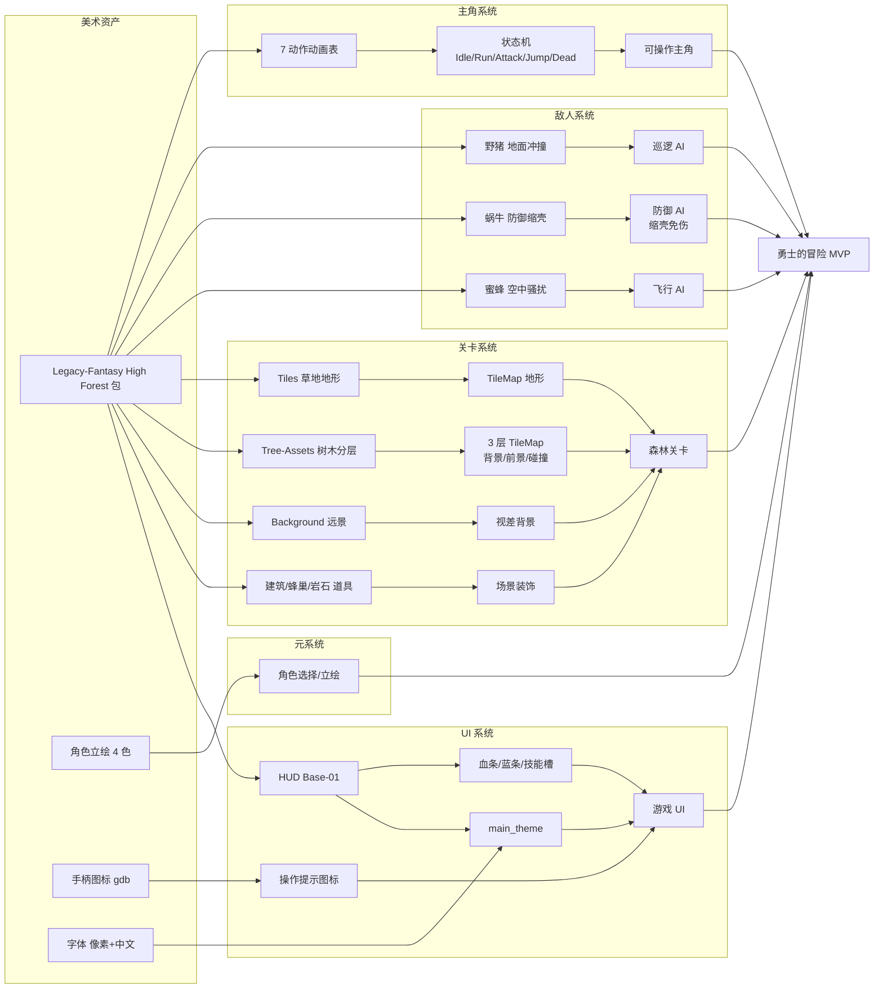

# 美术资产清单与说明

> 文档定位：**支撑后续游戏设计与开发**的美术资产全景手册。
> 覆盖范围：`assets/sprites/`、`assets/fonts/` 下全部美术资源，以及已生成的 `.tres` 美术资源（TileSet / Theme / StyleBox）。
> 音频资产见 [`docs/04_音频规范/01_音频资产清单.md`](../04_音频规范/01_音频资产清单.md)。
>
> 规则标签遵从项目宪法：`[P0]` 强制 / `[P1]` 正式阶段强制。本文件位于 `docs/`（已加 `.gdignore`，不参与 Godot 导入）。

---

## 目录

- [1. 概述](#1-概述)
- [2. 资产目录树](#2-资产目录树)
- [3. 像素艺术导入规范](#3-像素艺术导入规范)
- [4. Legacy-Fantasy High Forest 2.3（核心美术包）](#4-legacy-fantasy-high-forest-23核心美术包)
  - [4.1 主角（Character）](#41-主角character)
  - [4.2 怪物（Mob）](#42-怪物mob)
  - [4.3 地形瓦片（Assets/Tiles）](#43-地形瓦片assetstiles)
  - [4.4 树木资产（Assets/Tree-Assets）](#44-树木资产assetstree-assets)
  - [4.5 场景道具（Buildings / Hive / Interior / Props-Rocks）](#45-场景道具buildings--hive--interior--props-rocks)
  - [4.6 背景（Background）](#46-背景background)
  - [4.7 HUD / UI 元素（HUD/Base-01）](#47-hud--ui-元素hudbase-01)
- [5. 角色立绘（character/）](#5-角色立绘character)
- [6. 输入提示图标（gdb-gamepad-2）](#6-输入提示图标gdb-gamepad-2)
- [7. 角色头像图标（Knight_Rank_1）](#7-角色头像图标knight_rank_1)
- [8. 调试参考图（Legac-Fantasy_Debug_Map）](#8-调试参考图legac-fantasy_debug_map)
- [9. 字体（fonts/）](#9-字体fonts)
- [10. 已生成的美术 .tres 资源](#10-已生成的美术-tres-资源)
- [11. 资产—玩法映射](#11-资产玩法映射)
- [12. 资产缺口与后续建议](#12-资产缺口与后续建议)
- [附录 A：精灵帧参数速查表](#附录-a精灵帧参数速查表)
- [附录 B：完整资产清单](#附录-b完整资产清单)

---

## 1. 概述

### 1.1 项目定位

| 属性 | 值 |
|------|-----|
| 项目名 | `brave-adventure`（勇士的冒险） |
| 引擎 | Godot 4.6，Forward Plus 渲染 |
| 物理引擎 | Jolt Physics（3D 配置，2D 用默认） |
| 视口分辨率 | **480 × 270**（16:9 像素艺术基准分辨率） |
| 窗口分辨率 | 1920 × 1080（4× 整数缩放） |
| 拉伸模式 | `viewport`（完美像素，无糊化） |
| 贴图过滤 | `Nearest`（`default_texture_filter=0`，全局最近邻） |
| 游戏类型 | **2D 横版动作平台（Side-scroller Action Platformer）** |
| 美术风格 | **16-bit 像素艺术**，森林奇幻主题 |

> **关键设计约束**：视口 `480×270` 决定了所有美术资产的"游戏内显示尺寸"基准——
> 瓦片网格 **16×16 px**（一行 30 格、一列 ~17 格）；
> 主角帧 **64×80 px**（约占 4 格宽、5 格高，是典型横版主角体型）；
> 小怪帧 **32×32 px**（占 2×2 格，比主角小，视觉层级正确）。

### 1.2 资产总量

| 类别 | 数量 | 体积 | 说明 |
|------|------|------|------|
| 精灵（sprites） | **57 张** | 2.2 MB | 角色动画表 / 怪物 / 地形 / UI / 立绘 / 图标 |
| 字体（fonts） | 4 个 | 4.5 MB | 像素英文 + 中文黑体 |
| 美术 .tres 资源 | **8 个** | ~48 KB | TileSet(4) + Theme(1) + StyleBox(2) + AudioBus(1) |
| **合计** | — | **~6.7 MB** | 不含音频（音频见独立文档） |

### 1.3 美术包来源

| 子目录 | 来源 | 主题 | 用途评级 |
|--------|------|------|----------|
| `Legacy-Fantasy_High_Forest_2.3/` | itch.io 免费像素资产包（Legacy Fantasy 系列） | 森林奇幻横版动作 | ⭐ **核心**（主角/怪物/地形/HUD 全部来自此包） |
| `character/{blue,green,purple,red}/` | 4 色角色立绘（来源待定） | 角色选择/展示 | 🟡 立绘（非动画帧） |
| `gdb-gamepad-2/` | Gamepad Icons（key39/Kenney 系） | 输入提示 UI | 🟡 UI 辅助 |
| `Knight_Rank_1.webp` | 单张骑士图标 | 等级/头像 | 🟡 辅助 |
| `Legac-Fantasy_Debug_Map/` | High Forest 官方 MockUp（注意拼写缺 `y`） | 调试参考 | ⚪ 仅参考，非游戏资产 |

---

## 2. 资产目录树

```
assets/
├── sprites/
│   ├── Knight_Rank_1.webp                    # 骑士等级1图标（256×256）
│   ├── Legac-Fantasy_Debug_Map/              # ⚪ 调试参考图（MockUp，非游戏资产）
│   │   ├── Assets/Tiles.png
│   │   └── MockUp/{Cover,MockUp_01,Tiles}.png
│   ├── Legacy-Fantasy_High_Forest_2.3/       # ⭐ 核心美术包
│   │   ├── Background/Background.png         # 全屏远景背景
│   │   ├── Character/                        # 主角动画表（7 个动作）
│   │   │   ├── Idle/      Run/   Attack-01/
│   │   │   ├── Jump-Start/ Jump-End/ Jumlp-All/  Dead/
│   │   ├── Mob/                             # 怪物动画表
│   │   │   ├── Boar/{Idle,Walk,Run,Hit-Vanish}/
│   │   │   ├── Snail/{walk,Hide,Dead,all}.png
│   │   │   └── Small Bee/{Fly,Attack,Hit}/
│   │   ├── Assets/                          # 地形与场景道具
│   │   │   ├── Tiles.png        Tree-Assets.png   Buildings.png
│   │   │   ├── Hive.png         Interior-01.png   Props-Rocks.png
│   │   ├── Trees/{Dark,Golden,Green,Red,Yellow}-Tree.png + Background.png
│   │   └── HUD/Base-01.png                  # HUD/UI 元素表
│   ├── character/{blue,green,purple,red}/   # 4 色角色立绘（各 2 张）
│   └── gdb-gamepad-2/                       # 输入提示图标（4 种控制器）
├── fonts/
│   ├── PixelOperator8.ttf / PixelOperator8-Bold.ttf   # 像素英文字体
│   └── SmileySans-Oblique.ttf / .otf                  # 中文黑体（主主题用）
├── resources/
│   ├── tileset/{background,foreground,geometry}.tres  # 基于 Tree-Assets 的分层 TileSet
│   └── texture/cave.tres                              # 基于 Tiles 的洞穴 TileSet
└── themes/
    ├── main_theme.tres                      # 主主题（字体+按钮+滑块样式）
    ├── button_style_box_empty.tres          # 空按钮样式盒
    └── button_style_box_texture.tres        # 纹理按钮样式盒
```

---

## 3. 像素艺术导入规范

所有精灵已按像素艺术最佳实践导入（抽样 `Run-Sheet.png.import`、`Tiles.png.import`、`char_blue_1.png.import` 确认）：

| 导入参数 | 当前值 | 是否正确 | 说明 |
|----------|--------|----------|------|
| `compress/mode` | `0`（VRAM 无损） | ✅ | 像素艺术禁用有损压缩，避免色块伪影 |
| `mipmaps/generate` | `false` | ✅ | 像素艺术禁用 mipmap，避免缩放模糊 |
| `compress/lossy_quality` | `0.7` | ✅（未启用） | mode=0 时此项无效 |
| 全局 `default_texture_filter` | `0`（Nearest） | ✅ | 项目级最近邻过滤，保证硬边像素 |

**`[P0]` 后续新增精灵必须保持以上设置**。Godot 4 中可在 FileSystem 选中贴图 → Import 面板 → 勾选后点 Reimport 批量应用，或预设 `*.png` 的默认导入。

---

## 4. Legacy-Fantasy High Forest 2.3（核心美术包）

> 这是项目的**核心美术来源**，提供了主角、全部怪物、地形瓦片、场景道具、背景与 HUD。
> 风格统一为 **16-bit 像素艺术 + 暖色调森林奇幻**，无需混用其他画风资产即可完成 MVP。

### 4.1 主角（Character）

主角为一名**持剑勇士**，面向右侧，包含 7 个标准横版动作动画。所有动画表为**单行布局**，通过 `hframes` 横向切分。

#### 动画总览

| 动作 | 文件路径 | 尺寸 | 帧尺寸 | 帧数 | `hframes` | 用途 |
|------|----------|------|--------|------|-----------|------|
| **Idle 待机** | `Character/Idle/Idle-Sheet.png` | 256×80 | 64×80 | **4** | 4 | 默认静止呼吸循环 |
| **Run 奔跑** | `Character/Run/Run-Sheet.png` | 640×80 | 64×80 | **10** | 10 | 水平移动循环（完整迈步周期） |
| **Attack-01 攻击** | `Character/Attack-01/Attack-01-Sheet.png` | 768×80 | 64×80 | **12** | 12 | 单次挥剑（起手→挥击→收招） |
| **Jump-Start 起跳** | `Character/Jump-Start/Jump-Start-Sheet.png` | 256×64 | 64×64 | **4** | 4 | 起跳瞬间 |
| **Jump-End 落地** | `Character/Jump-End/Jump-End-Sheet.png` | 192×64 | 64×64 | **3** | 3 | 落地缓冲 |
| **Jump-All 跳跃全流程** | `Character/Jumlp-All/Jump-All-Sheet.png` | 960×64 | 64×64 | **15** | 15 | 起跳+滞空+下落+落地合并表（注意目录名 `Jumlp` 是源包拼写错误） |
| **Dead 死亡** | `Character/Dead/Dead-Sheet.png` | 640×64 | 64×64 | **10** | 10 | 死亡倒地动画（一次性，不循环） |

> **注意帧高差异**：Idle/Run/Attack 帧高 **80px**（含持剑高举空间），Jump/Dead 帧高 **64px**。
> 接入 `AnimatedSprite2D` 时，**必须为每个动画单独设置 `hframes` 并对齐帧尺寸**；帧高不同的动画建议用统一碰撞框锚点（脚底中心）对齐，避免跳跃时角色"跳位"。

#### Godot 接入建议

```gdscript
# 主角用 AnimatedSprite2D + SpriteFrames 资源
# 推荐做法：新建 SpriteFrames，为每个动作创建独立 Animation，
#           设置对应的 hframes，并勾选 Loop（除 Attack/Dead 外）
#
# 动画帧率建议（fps）：
#   Idle:  6 fps  (loop)
#   Run:   12 fps (loop)
#   Attack:15 fps (no loop, 触发命中判定的关键帧在第 5-7 帧挥剑中段)
#   Jump:  10 fps (no loop)
#   Dead:  8 fps  (no loop)
#
# 状态机映射（见宪法 §7.1）：
#   IDLE → RUN（移动输入）→ IDLE
#   ANY  → ATTACK（攻击键，播完回 IDLE/RUN）
#   ANY  → JUMP（跳跃键，Jump-Start → Jump-All 滞空段 → Jump-End 落地）
#   HP<=0→ DEAD
```

**`[P0]` 翻转处理**：主角默认面朝右。向左移动时用 `sprite.flip_h = true`，**禁止**为左向另出一张贴图（浪费内存且易不同步）。

---

### 4.2 怪物（Mob）

共 **3 种怪物**，体型均小于主角，符合"主角视觉焦点"原则。每种怪物含多个动作动画表。

#### 4.2.1 Boar 野猪（地面冲撞型敌人）

体型 **32×32 px**，棕灰色野猪，有獠牙。每个动作目录含 3 个配色变体：`*-Sheet.png`（彩色原版）、`*-White.png`（白色剪影）、`*-Black.png`（黑色剪影）。

| 动作 | 文件 | 尺寸 | 帧数 | `hframes` | 变体文件 |
|------|------|------|------|-----------|----------|
| Idle 待机 | `Boar/Idle/Idle-Sheet.png` | 192×32 | **6** | 6 | `-White`、`export-Back`（背面） |
| Walk 行走 | `Boar/Walk/Walk-Base-Sheet.png` | 288×32 | **9** | 9 | `-White`、`SheetBlack`（注意命名不一致） |
| Run 奔跑 | `Boar/Run/Run-Sheet.png` | 288×32 | **9** | 9 | `-White`、`-Black` |
| Hit-Vanish 受击/消失 | `Boar/Hit-Vanish/Hit-Sheet.png` | 192×32 | **6** | 6 | `-White`、`-Black` |

**设计含义**：野猪具备 Idle/Walk/Run 三档移动 + Hit 受击，适合做**巡逻→发现玩家→冲撞**的 AI。`Hit-Vanish` 含消失帧，可用于死亡淡出。

> **⚠️ 命名不一致**：`Walk-Base-SheetBlack.png`（无连字符）vs 其他 `*-Black.png`。接入时建议统一重命名或在资源映射表里显式记录，避免脚本 `load` 路径错误。

#### 4.2.2 Snail 蜗牛（缓慢防御型敌人）

体型 **32×32 px**，带螺旋壳的蜗牛。有独立的单动作表 + 一张合并表 `all.png`。

| 动作 | 文件 | 尺寸 | 帧数 | `hframes` |
|------|------|------|------|-----------|
| Walk 行走 | `Snail/walk-Sheet.png` | 384×32 | **12** | 12 |
| Hide 躲入壳 | `Snail/Hide-Sheet.png` | 384×32 | **12** | 12 |
| Dead 死亡 | `Snail/Dead-Sheet.png` | 384×32 | **12** | 12 |
| **All 合并表** | `Snail/all.png` | 384×160 | **12×5=60** | 12（`vframes=5`） |

**设计含义**：蜗牛有"**缩壳防御**"机制（Hide 动作），可设计为"玩家攻击时缩壳免伤、露出时才可击杀"的防御型敌人。`all.png` 是 5 行合并表，包含上述动作及其他姿态，可整体导入一个 `SpriteFrames` 资源复用。

**`[P1]` 优化建议**：正式开发期用 `all.png` 单表 + `vframes=5` 替代多个单表，减少 Texture 切换与 draw call。

#### 4.2.3 Small Bee 小蜜蜂（飞行型敌人）

体型 **64×64 px**（比地面怪大，因含翅膀扇动空间），黄黑条纹蜜蜂。

| 动作 | 文件 | 尺寸 | 帧数 | `hframes` |
|------|------|------|------|-----------|
| Fly 飞行 | `Small Bee/Fly/Fly-Sheet.png` | 256×64 | **4** | 4 |
| Attack 攻击（蛰刺） | `Small Bee/Attack/Attack-Sheet.png` | 256×64 | **4** | 4 |
| Hit 受击 | `Small Bee/Hit/Hit-Sheet.png` | 256×64 | **4** | 4 |

**设计含义**：飞行敌人，不受地形碰撞约束（或走特殊碰撞层），适合做**空中骚扰型敌人**——飞行靠近 → Attack 蛰刺 → 受击后退。4 帧循环，翅膀扇动节奏明快。

> **帧数疑点**：256÷64=4 帧，但也可能是 256÷32=8 帧（若实际蜜蜂主体只占 32 高）。接入时需在编辑器肉眼核对帧边界，以视觉无错位为准。

---

### 4.3 地形瓦片（Assets/Tiles）

| 属性 | 值 |
|------|-----|
| 文件 | `Assets/Tiles.png` |
| 尺寸 | 400 × 400 px |
| 网格 | **16 × 16 px**（25×25 格） |
| 透明通道 | 有 |
| 内容 | 草地、泥土、石头、平台边缘、斜坡、洞穴壁等地形瓦片 |
| 配色 | 暖棕泥土 + 翠绿草地，森林地表风格 |

**已配置 TileSet**：`assets/resources/tileset/`（实际为 `texture/cave.tres`，见 §10）。配置了：
- `physics_layer_0/collision_layer = 1`（碰撞层 1，玩家与地形碰撞）
- `terrain_set_0`，地形名 **"Grass"**（紫色标记色，仅编辑器可见）
- 含 `texture_origin` 偏移的大尺寸瓦片（如 `0:0` 为 1×2 格高的草丛）
- 部分瓦片含自定义物理多边形（如斜坡 `5:7` 为非矩形碰撞）

**使用方式**：在 `TileMapLayer`（Godot 4.3+）中引用 `cave.tres`，用 Terrain 笔刷自动连接草地边缘，绘制可碰撞的地形。

---

### 4.4 树木资产（Assets/Tree-Assets）

| 属性 | 值 |
|------|-----|
| 文件 | `Assets/Tree-Assets.png` |
| 尺寸 | 336 × 400 px |
| 网格 | 16 × 16 px（21×25 格） |
| 内容 | 树干、树冠（多季节色）、树桩、灌木、落叶等地被 |

**这是分层渲染的关键资产**——已派生出 **3 个 TileSet**（见 §10），分别承载不同的渲染与碰撞职责：

| TileSet | 地形名 | 职责 | 物理层 |
|---------|--------|------|--------|
| `tileset/background.tres` | **Leaves** | 背景层树冠装饰（不碰撞） | 无 |
| `tileset/foreground.tres` | — | 前景层树梢遮挡（`y_sort_origin` 已设，不碰撞） | 无 |
| `tileset/geometry.tres` | **Trunk** | 几何/碰撞层，**树干可碰撞** | `collision_layer=1` |

此外 `Trees/` 目录还有 **5 棵独立大树**（Dark/Golden/Green/Red/Yellow-Tree，均 1344×1200）+ 一张 `Trees/Background.png`（896×256），是更高清的整树装饰，用于场景点缀（非瓦片拼贴）。

> **`[P1]` 分层建议**：用 3 个 `TileMapLayer` 节点分别挂 background / foreground / geometry，配合 `y_sort_enabled` 实现"角色可走在树后"的纵深感。

---

### 4.5 场景道具（Buildings / Hive / Interior / Props-Rocks）

均为 **400×400 px**（Interior/Hive/Buildings）或接近尺寸的道具表，16×16 网格。

| 文件 | 尺寸 | 内容 | 用途 |
|------|------|------|------|
| `Assets/Buildings.png` | 400×400 | 房屋、屋顶、门窗、烟囱 | 关卡内的建筑背景 |
| `Assets/Hive.png` | 400×400 | 蜂巢（与 Small Bee 呼应） | 蜜蜂敌人的出生点/巢穴装饰 |
| `Assets/Interior-01.png` | 400×400 | 室内场景（地板、墙、家具） | 室内关卡（如关卡 Boss 房） |
| `Assets/Props-Rocks.png` | 288×336 | 岩石、矿石、散落道具 | 场景点缀 / 可破坏物 / 掩体 |

> 这些道具表**尚未配置为 TileSet**（§10 无对应 `.tres`）。后续需要时按 `cave.tres` 的模式新建。

---

### 4.6 背景（Background）

| 属性 | 值 |
|------|-----|
| 文件 | `Background/Background.png` |
| 尺寸 | **480 × 272 px** |
| 内容 | 森林远景：天空渐变 + 远山剪影 + 树林层次 |
| 用途 | 全屏静态/视差背景 |

**`[P1]` 视差滚动**：尺寸 480×272 几乎等于视口 480×270，适合作为最远层视差背景（`ParallaxLayer` 的 `motion_scale` 设为 0.1~0.3）。如需循环无缝，需检查左右边缘是否能拼接（当前为单张非循环图，横向滚动时可能出现接缝，后续可考虑扩展为 2× 宽）。

---

### 4.7 HUD / UI 元素（HUD/Base-01）

| 属性 | 值 |
|------|-----|
| 文件 | `HUD/Base-01.png` |
| 尺寸 | 432 × 304 px |
| 内容 | 生命球/血条、魔法条、技能槽、按钮边框、面板边框、箭头、滑块旋钮、图标等 UI 元素 |

**已被主题资源引用**（见 §10 `main_theme.tres`）：
- `StyleBoxTexture`（按钮 focus 态）引用 `region = Rect2(64, 272, 16, 16)` 做 9-slice 按钮底
- `HSlider` 的 grabber 旋钮引用 `Rect2(3, 130, 11, 11)` / `Rect2(19, 130, 11, 11)`（normal / highlight 两态）
- `PanelContainer` 面板用 `button_style_box_texture.tres` 做 9-slice 边框

**设计含义**：这是**游戏内 HUD 的核心素材**——生命值、魔法值、技能冷却槽、设置面板全部从此表切片。后续做血条/蓝条时，用 `AtlasTexture` 指定 `region` 切出对应元素即可。

---

## 5. 角色立绘（character/）

| 属性 | 值 |
|------|-----|
| 目录 | `character/{blue,green,purple,red}/` |
| 文件 | 每色 2 张：`char_{color}_1.png`（448×616）、`char_{color}_2.png`（448×392） |
| 内容 | 4 种颜色（蓝/绿/紫/红）的角色全身立绘，非动画帧 |

**分析**：
- 尺寸远大于游戏内精灵（448 宽 vs 主角 64 宽），**不是用于游戏内角色 sprite**。
- 推测用途：**角色选择界面立绘**、**剧情对话头像**、**菜单展示图**。
- 4 色对应 4 个可选角色或 4 种职业/皮肤。

**`[P0]` 待确认**：这些立绘与主角动画表（High Forest 的持剑勇士）**风格与角色是否一致**需人工核对。若不一致，建议明确分工——立绘用于选角/对话，High Forest 主角用于实际操作；或后续替换为统一角色。

---

## 6. 输入提示图标（gdb-gamepad-2）

| 属性 | 值 |
|------|-----|
| 目录 | `gdb-gamepad-2/` |
| 文件 | 4 张，均 **560 × 640 px** |
| 内容 | 键盘 / PlayStation / Switch / Xbox 四种控制器的按键图标表 |

| 文件 | 平台 |
|------|------|
| `gdb-keyboard-2.png` | 键盘（WASD、空格、Shift 等） |
| `gdb-playstation-2.png` | PlayStation（△○✕□、L1/R1 等） |
| `gdb-switch-2.png` | Switch Pro 手柄 |
| `gdb-xbox-2.png` | Xbox 手柄（ABXY、LB/RB 等） |

**用途**：操作提示 UI（"按 [J] 攻击"、教程提示、按键设置界面）。配合 Godot 的 `Input` 系统检测当前设备，动态切换显示对应平台的按键图标切片。

**`[P1]` 接入建议**：每张图是按键图标表，需用 `AtlasTexture` 按 16×16 或实际按键网格切分，建立 `InputIcon` 资源映射 `action_name → 图标 region`。

---

## 7. 角色头像图标（Knight_Rank_1）

| 属性 | 值 |
|------|-----|
| 文件 | `Knight_Rank_1.webp` |
| 尺寸 | 256 × 256 px |
| 格式 | WebP（有损，与项目其他 PNG 无损不一致） |
| 内容 | 骑士等级 1 头像/图标 |

**用途推测**：角色升级系统的等级图标、成就图标、头像。

> **`[P0]` 格式一致性**：这是项目中唯一的 `.webp` 文件。Godot 4 支持 WebP，但为保持像素艺术资产格式统一，建议后续转换为 PNG（无损）。WebP 有损压缩会导致像素边缘糊化，与全局 Nearest 过滤冲突。

---

## 8. 调试参考图（Legac-Fantasy_Debug_Map）

> ⚠️ **注意：目录名 `Legac-Fantasy` 少了一个 `y`（应为 `Legacy`），是源包命名错误。**
> 这些是 High Forest 资产包作者提供的**关卡 MockUp 整图**，用于展示素材如何组合，**不是游戏运行时资产**。

| 文件 | 尺寸 | 用途 |
|------|------|------|
| `MockUp/Cover.png` | 1920×1088 | 资产包封面展示图 |
| `MockUp/MockUp_01.png` | 672×384 | 关卡布局参考 |
| `MockUp/Tiles.png` | 1664×1856 | 瓦片全集展示 |
| `Assets/Tiles.png` | 416×464 | 瓦片子集 |

**建议**：这些图体积较大（668K）且不参与游戏，可考虑移出 `assets/`（Godot 会导入它们占用包体），或加 `.gdignore`。当前已被 Godot 导入（有 `.import`），**会进入最终包体**。

---

## 9. 字体（fonts/）

| 文件 | 格式 | 大小 | 内容 | 用途 |
|------|------|------|------|------|
| `PixelOperator8.ttf` | TTF | 20K | 8px 像素英文字体 | 游戏内英文 HUD/对话（像素风统一） |
| `PixelOperator8-Bold.ttf` | TTF | 20K | 8px 像素英文粗体 | 标题/强调文字 |
| `SmileySans-Oblique.ttf` | TTF | 2.5M | **得意黑**（开源中文黑体，倾斜） | 中文 UI/对话 |
| `SmileySans-Oblique.otf` | OTF | 1.9M | 同上 OTF 版 | **主主题 `main_theme.tres` 实际引用此 OTF** |

**`[P0]` 注意**：
1. `main_theme.tres` 引用的是 `.otf` 版（1.9M），`.ttf` 版（2.5M）**未被引用**，存在冗余。建议删除未用的 `.ttf` 版节省 2.5M 包体，或确认是否需要两版。
2. 中文字体体积大（1.9M+），正式发布时应**只子集化用到的汉字**（用 `fonttools` 或 Godot 的字体子集化），可降至几十 KB。
3. 像素英文 `PixelOperator8` 与中文 `SmileySans` 混排时字号需调协，建议英文用 8px 基准、中文用其整数倍。

---

## 10. 已生成的美术 .tres 资源

> 这些资源表明项目**已开始关卡与 UI 搭建**。状态盘点如下。

### 10.1 TileSet 资源（4 个）

| 文件 | 源贴图 | 地形 | 碰撞层 | 状态 | 备注 |
|------|--------|------|--------|------|------|
| `resources/texture/cave.tres` | `Tiles.png` | Grass | `collision_layer=1` | ✅ 较完整 | 草地+泥土地形，含斜坡物理多边形。**命名 misleading**：文件在 `texture/` 目录却叫 `cave`，且与下述 tileset 同源 |
| `resources/tileset/background.tres` | `Tree-Assets.png` | Leaves | 无 | ✅ | 背景树冠，含 probability=0.3 随机点缀 |
| `resources/tileset/foreground.tres` | `Tree-Assets.png` | — | 无 | 🟡 仅 10 块 | 前景树梢，已设 `y_sort_origin`，瓦片较少 |
| `resources/tileset/geometry.tres` | `Tree-Assets.png` | Trunk | `collision_layer=1` | ✅ | 树干碰撞层，含大尺寸瓦片（2×1、1×2） |

**`[P0]` 命名/路径问题**：
- `cave.tres` 放在 `resources/texture/` 下，但它是 TileSet（应在 `tileset/`）。且名为 `cave`（洞穴）但源贴图 `Tiles.png` 是草地/森林。**建议**：迁移到 `tileset/` 并重命名为 `forest_ground.tres`，同步更新引用（当前 `scenes/` 为空，无引用，可安全迁移）。
- `texture/` 目录当前只有这一个文件，迁移后该目录可删除。

### 10.2 Theme 资源（1 个 + 2 个 StyleBox）

| 文件 | 类型 | 内容 |
|------|------|------|
| `themes/main_theme.tres` | Theme | 主主题：字体=SmileySans-Oblique.otf；配置了 Button（黄色按下态+黑色描边）、HSlider（自定义旋钮）、Label（带阴影）、PanelContainer（9-slice 面板） |
| `themes/button_style_box_empty.tres` | StyleBoxEmpty | 空 Button 样式（4px 内边距），用于 normal/hover/pressed/disabled 态 |
| `themes/button_style_box_texture.tres` | StyleBoxTexture | 纹理 Button 样式（focus 态），9-slice，引用 HUD Base-01 的 `Rect2(64,272,16,16)` |

**状态**：✅ 主题已成型，可直接用于菜单/HUD 的 Button、HSlider、Panel。

### 10.3 AudioBus（1 个，非美术但相关）

| 文件 | 类型 | 内容 |
|------|------|------|
| `bus/bus.tres` | AudioBusLayout | Master + **SFX** + **New Bus 2**（未命名！） |

> ⚠️ `New Bus 2` 是 Godot 默认未命名总线。**`[P0]` 建议重命名**为 `Music`（音乐总线）或 `UI`，否则代码引用易混淆。详见音频文档。

---

## 11. 资产—玩法映射

> 基于资产能力反推可支撑的玩法设计。Mermaid 图展示资产如何组合成游戏系统。



### 玩法能力清单（资产已就绪）

| 玩法系统 | 所需资产 | 就绪度 | 说明 |
|----------|----------|--------|------|
| 主角移动+跳跃 | Run/Jump/Jump-Start/Jump-End | ✅ 100% | 帧齐全 |
| 主角近战攻击 | Attack-01 | ✅ 100% | 12 帧完整挥砍 |
| 主角受击/死亡 | Dead | 🟡 50% | 有死亡，**无独立受击(Hurt)动画** |
| 野猪敌人（冲撞） | Boar Idle/Walk/Run/Hit | ✅ 100% | 可做完整 AI |
| 蜗牛敌人（防御） | Snail Walk/Hide/Dead | ✅ 100% | 缩壳机制资产齐 |
| 蜜蜂敌人（飞行） | Bee Fly/Attack/Hit | ✅ 100% | 空中敌人 |
| 森林地形关卡 | Tiles + Tree-Assets 分层 | ✅ 100% | TileSet 已配置 |
| HUD（血/蓝/技能） | HUD Base-01 + Theme | ✅ 100% | 主题已就绪 |
| 操作提示 | 手柄图标 4 平台 | ✅ 100% | 需切片映射 |
| 角色选择 | 4 色立绘 | 🟡 70% | 立绘有，但与主角风格一致性待确认 |
| 视差背景 | Background | ✅ 100% | 单层，可扩展 |
| 音效配合 | Minifantasy SFX + Kenney | ✅ 100% | 见音频文档 |

---

## 12. 资产缺口与后续建议

### 12.1 `[P0]` 必须补齐（阻断 MVP）

| 缺口 | 影响 | 建议 |
|------|------|------|
| **主角受击(Hurt)动画缺失** | 受击时只能用 Idle/Run 凑，表现力差 | 用 Attack 起手帧或 Dead 前几帧临时代替；或从源包找 Hurt 动作补全 |
| **`cave.tres` 命名/路径混乱** | 位于 `texture/` 却是 TileSet，名为 cave 实为草地 | 迁移至 `tileset/forest_ground.tres`，更新引用（当前无引用，安全） |
| **`Knight_Rank_1.webp` 格式不一致** | 唯一 webp，有损与像素风冲突 | 转 PNG 无损 |
| **`bus.tres` 的 `New Bus 2` 未命名** | 音乐总线无法清晰引用 | 重命名为 `Music` |

### 12.2 `[P1]` 正式开发建议

| 项 | 建议 |
|----|------|
| 蜗牛合并表 | 用 `Snail/all.png`（12×5）单表替代 3 个单表，减 draw call |
| 野猪命名 | 统一 `Walk-Base-SheetBlack.png` → `Walk-Base-Sheet-Black.png` |
| 道具 TileSet | 为 Buildings/Hive/Interior/Props-Rocks 配置 TileSet（目前未配） |
| Debug Map 移出 | `Legac-Fantasy_Debug_Map/` 加 `.gdignore` 或移出 `assets/`，避免进包体 |
| 字体子集化 | 发布前对 SmileySans 做汉字子集，1.9M → ~50K |
| 字体冗余 | 删除未引用的 `SmileySans-Oblique.ttf`（2.5M） |
| 立绘风格核对 | 确认 4 色立绘与主角动画是否同角色，决定选角系统设计 |
| 视差背景扩展 | Background 单图横向滚动会接缝，可做 2× 宽无缝图 |

### 12.3 资产命名规范建议 `[P0]`

遵从宪法 §2.2 `snake_case`，当前部分资产不符，建议逐步统一（重命名需同步更新 `.tres` 引用 UID）：

| 现状 | 建议 |
|------|------|
| `Legacy-Fantasy_High_Forest_2.3/` | 含连字符+点，保留源包原名可接受（外部资产） |
| `Legac-Fantasy_Debug_Map/` | 拼写错误，但为外部资产可不动 |
| `Jumlp-All/` | 源包拼写错误（Jump），记录即可 |
| `Small Bee/` | 含空格，Godot 路径需转义，建议改 `small_bee/` |
| `Walk-Base-SheetBlack.png` | 改 `walk_base_sheet_black.png` |

---

## 附录 A：精灵帧参数速查表

> 接入 `AnimatedSprite2D` / `SpriteFrames` 时的切分参数。所有表均为**单行布局**，只需设 `hframes`（蜗牛 `all.png` 需额外 `vframes`）。

### 主角（Character）— `hframes` only

| 动画 | 路径（相对 `assets/sprites/Legacy-Fantasy_High_Forest_2.3/`） | 尺寸 | `hframes` | 帧尺寸 | loop |
|------|------|------|-----------|--------|------|
| idle | `Character/Idle/Idle-Sheet.png` | 256×80 | **4** | 64×80 | ✅ |
| run | `Character/Run/Run-Sheet.png` | 640×80 | **10** | 64×80 | ✅ |
| attack | `Character/Attack-01/Attack-01-Sheet.png` | 768×80 | **12** | 64×80 | ❌ |
| jump_start | `Character/Jump-Start/Jump-Start-Sheet.png` | 256×64 | **4** | 64×64 | ❌ |
| jump_end | `Character/Jump-End/Jump-End-Sheet.png` | 192×64 | **3** | 64×64 | ❌ |
| jump_all | `Character/Jumlp-All/Jump-All-Sheet.png` | 960×64 | **15** | 64×64 | ❌ |
| dead | `Character/Dead/Dead-Sheet.png` | 640×64 | **10** | 64×64 | ❌ |

### 怪物（Mob）— `hframes` only（除蜗牛 all）

| 怪物/动画 | 路径（相对 `.../Mob/`） | 尺寸 | `hframes` | 帧尺寸 | loop |
|-----------|------|------|-----------|--------|------|
| boar/idle | `Boar/Idle/Idle-Sheet.png` | 192×32 | **6** | 32×32 | ✅ |
| boar/walk | `Boar/Walk/Walk-Base-Sheet.png` | 288×32 | **9** | 32×32 | ✅ |
| boar/run | `Boar/Run/Run-Sheet.png` | 288×32 | **9** | 32×32 | ✅ |
| boar/hit | `Boar/Hit-Vanish/Hit-Sheet.png` | 192×32 | **6** | 32×32 | ❌ |
| bee/fly | `Small Bee/Fly/Fly-Sheet.png` | 256×64 | **4** | 64×64 | ✅ |
| bee/attack | `Small Bee/Attack/Attack-Sheet.png` | 256×64 | **4** | 64×64 | ❌ |
| bee/hit | `Small Bee/Hit/Hit-Sheet.png` | 256×64 | **4** | 64×64 | ❌ |
| snail/walk | `Snail/walk-Sheet.png` | 384×32 | **12** | 32×32 | ✅ |
| snail/hide | `Snail/Hide-Sheet.png` | 384×32 | **12** | 32×32 | ❌ |
| snail/dead | `Snail/Dead-Sheet.png` | 384×32 | **12** | 32×32 | ❌ |
| snail/all | `Snail/all.png` | 384×160 | `hframes=12` `vframes=5` | 32×32 | 视行而定 |

### 非动画表（地形/UI/立绘/图标）— 无需切分（或按 16×16 网格）

| 文件 | 尺寸 | 网格/用途 |
|------|------|-----------|
| `Assets/Tiles.png` | 400×400 | 16×16 瓦片（25×25 格） |
| `Assets/Tree-Assets.png` | 336×400 | 16×16 瓦片（21×25 格） |
| `Assets/Buildings.png` / `Hive.png` / `Interior-01.png` | 400×400 | 16×16 瓦片 |
| `Assets/Props-Rocks.png` | 288×336 | 16×16 瓦片 |
| `Background/Background.png` | 480×272 | 整图视差背景 |
| `HUD/Base-01.png` | 432×304 | UI 元素表，按需 AtlasTexture 切片 |
| `Trees/*-Tree.png` | 1344×1200 | 整树装饰 |
| `character/*/char_*_1.png` | 448×616 | 立绘 |
| `character/*/char_*_2.png` | 448×392 | 立绘 |
| `gdb-gamepad-2/*.png` | 560×640 | 按键图标表 |
| `Knight_Rank_1.webp` | 256×256 | 单图标 |

---

## 附录 B：完整资产清单

### B.1 精灵（57 张）

<details>
<summary>展开完整列表</summary>

**Legacy-Fantasy High Forest 2.3（31 张）**
- Background: `Background/Background.png`
- Character(7): `Idle/` `Run/` `Attack-01/` `Jump-Start/` `Jump-End/` `Jumlp-All/` `Dead/` 各 1 张
- Mob-Boar(13): `Idle/{Idle-Sheet,Idle-Sheet-White,Idle-Sheet-export-Back}.png`、`Walk/{Walk-Base-Sheet,Walk-Base-Sheet-White,Walk-Base-SheetBlack}.png`、`Run/{Run-Sheet,Run-Sheet-White,Run-Sheet-Black}.png`、`Hit-Vanish/{Hit-Sheet,Hit-Sheet-White,Hit-Sheet-Black}.png`
- Mob-Snail(4): `walk-Sheet.png` `Hide-Sheet.png` `Dead-Sheet.png` `all.png`
- Mob-Bee(3): `Fly/Fly-Sheet.png` `Attack/Attack-Sheet.png` `Hit/Hit-Sheet.png`
- Assets(7): `Tiles.png` `Tree-Assets.png` `Buildings.png` `Hive.png` `Interior-01.png` `Props-Rocks.png`
- HUD(1): `Base-01.png`
- Trees(6): `Background.png` `Dark/Golden/Green/Red/Yellow-Tree.png`

**Legac-Fantasy Debug Map（4 张）** — 参考用
- `Assets/Tiles.png` `MockUp/{Cover,MockUp_01,Tiles}.png`

**character（8 张）** — 立绘
- `blue/{char_blue_1,char_blue_2}.png`、`green/*`、`purple/*`、`red/*`

**gdb-gamepad-2（4 张）** — 输入图标
- `gdb-{keyboard,playstation,switch,xbox}-2.png`

**根目录（1 张）**
- `Knight_Rank_1.webp`

</details>

### B.2 字体（4 个）

- `fonts/PixelOperator8.ttf`（像素英文）、`PixelOperator8-Bold.ttf`
- `fonts/SmileySans-Oblique.otf`（中文，**主题引用**）、`SmileySans-Oblique.ttf`（冗余）

### B.3 美术 .tres 资源（8 个）

- TileSet: `resources/texture/cave.tres`、`resources/tileset/{background,foreground,geometry}.tres`
- Theme: `themes/main_theme.tres`
- StyleBox: `themes/{button_style_box_empty,button_style_box_texture}.tres`
- AudioBus: `bus/bus.tres`（详见音频文档）

---

> **文档版本**：v1.0 ｜ **生成方式**：`sprite-analyzer` skill + `sips` 元数据 + AI 视觉分析 ｜ **下次更新触发**：新增资产 / 配置新 TileSet / 玩法系统落地时
