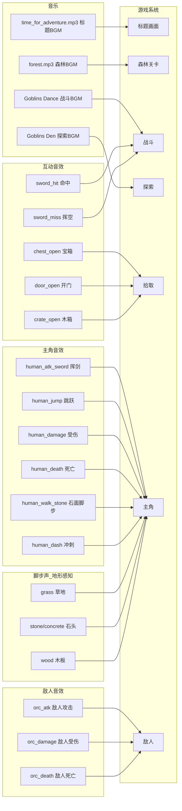

# 音频资产清单与说明

> 文档定位：**支撑后续游戏设计与开发**的音频资产全景手册。
> 覆盖范围：`assets/music/`、`assets/sounds/` 下全部音频资源，以及 `assets/bus/bus.tres` 总线布局。
> 美术资产见 [`docs/03_美术规范/01_美术资产清单.md`](../03_美术规范/01_美术资产清单.md)。
>
> 本文件位于 `docs/`（已加 `.gdignore`，不参与 Godot 导入）。

---

## 目录

- [1. 概述](#1-概述)
- [2. 资产总量与分布](#2-资产总量与分布)
- [3. 背景音乐（music/）](#3-背景音乐music)
- [4. Minifantasy Dungeon 音效与音乐](#4-minifantasy-dungeon-音效与音乐)
- [5. Kenney Impact Sounds 通用音效](#5-kenney-impact-sounds-通用音效)
- [6. Audio Bus 总线布局](#6-audio-bus-总线布局)
- [7. 音频—玩法映射](#7-音频玩法映射)
- [8. 缺口与优化建议](#8-缺口与优化建议)

---

## 1. 概述

音频资产分为三大来源，覆盖**背景音乐**与**全场景音效**（战斗、脚步、互动、撞击）：

| 来源 | 类型 | 体积 | 用途 |
|------|------|------|------|
| `music/*.mp3` | 商用音乐 | 3.3 MB | 主菜单/关卡 BGM |
| `Minifantasy_Dungeon_{SFX,Music}/` | Minifantasy 风格 | 44 MB | 战斗/脚步/宝箱等地牢音效 + 2 首音乐 |
| `kenney_impact-sounds/` | Kenney Impact Sounds | 1.7 MB | 脚步声 + 各材质撞击声（通用） |

**风格判断**：Minifantasy 系列是像素游戏专用音效，与本项目像素美术风格高度匹配；Kenney 音效为通用写实音效，用于补充环境/物理音效。

---

## 2. 资产总量与分布

| 类别 | 文件数 | 格式 | 体积 |
|------|--------|------|------|
| 背景音乐 mp3 | 2 | MP3 | 3.3 MB |
| Minifantasy 音乐 | 2 | WAV | 28 MB |
| Minifantasy 音效 | 62 | WAV(58) + MP3(4) | 16 MB |
| Kenney 音效 | 130 | OGG | 1.7 MB |
| **合计** | **196** | — | **~49 MB** |

> ⚠️ **音频是当前项目体积大头**（49MB，占 assets/ 绝大部分）。`Minifantasy_Dungeon_Music` 的两首 WAV 单首 13~15MB，是主要膨胀源，正式发布前需压缩（见 §8）。

---

## 3. 背景音乐（music/）

| 文件 | 体积 | 推测用途 |
|------|------|----------|
| `music/forest.mp3` | 1.8 MB | 森林关卡 BGM（与森林美术主题对应） |
| `music/time_for_adventure.mp3` | 1.5 MB | 主菜单 / 标题画面 BGM（"冒险时刻"） |

**`[P0]` 格式建议**：MP3 适合音乐（压缩率高）。Godot 4 中音乐建议用 `AudioStreamOggVorbis`（`.ogg`）或保持 MP3；循环音乐需在 Import 面板设置 loop 点。当前 MP3 可保留。

---

## 4. Minifantasy Dungeon 音效与音乐

> 来源：[Minifantasy - Dungeon SFX/Music](https://pixelfrog-assets.itch.io/)（Pixel Frog 的免费像素资产）。
> 命名规范 `{序号}_{对象}_{动作}_{变体}`，非常清晰，可直接映射到游戏事件。

### 4.1 音乐（Music/，2 首）

| 文件 | 体积 | 用途 |
|------|------|------|
| `Goblins_Den_(Regular).wav` | 15 MB | 地牢常规探索 BGM（哥布林巢穴） |
| `Goblins_Dance_(Battle).wav` | 13 MB | 战斗 BGM（节奏更激烈） |

> ⚠️ **WAV 用于音乐体积过大**（28MB/2首）。WAV 是无损未压缩，适合短音效，**不适合长音乐**。`[P0]` 建议转 OGG（可降至 ~2MB/首），见 §8。

### 4.2 音效（SFX/，62 个）

按编号前缀的功能分组：

#### 容器互动音效（17 个）

| 编号前缀 | 动作 | 变体数 | 格式 | 游戏事件 |
|----------|------|--------|------|----------|
| `01_chest_open` | 宝箱开启 | 4 | WAV | 拾取宝箱 |
| `02_chest_close` | 宝箱关闭 | 3 | WAV | 关闭宝箱 |
| `03_crate_open` | 木箱开启 | 3 | WAV | 破坏/打开木箱 |
| `04_sack_open` | 布袋开启 | 3 | WAV | 拾取布袋道具 |
| `05_door_open` | 门开启 | 2 | **MP3** | 开门（注意是 MP3，与其余 WAV 不一致） |
| `06_door_close` | 门关闭 | 2 | **MP3** | 关门 |

#### 人类（Human/主角）战斗与动作音效（24 个）

| 编号前缀 | 动作 | 变体数 | 游戏事件 |
|----------|------|--------|----------|
| `07_human_atk_sword` | 剑攻击 | 3 | 主角挥剑 |
| `08_human_charge` | 蓄力 | 2 | 主角蓄力攻击起手 |
| `09_human_charging_loop` | 蓄力中循环 | 2（loop） | 主角蓄力持续音 |
| `10_human_special_atk` | 特殊攻击 | 2 | 主角大招/技能 |
| `11_human_damage` | 受伤 | 3 | 主角被击中 |
| `12_human_jump` | 跳跃 | 3 | 主角起跳 |
| `13_human_jump_land` | 落地 | 2 | 主角落地 |
| `14_human_death_spin` | 死亡旋转 | 1 | 主角死亡 |
| `15_human_dash` | 冲刺 | 2 | 主角闪避/冲刺 |
| `16_human_walk_stone` | 石面行走 | 3 | 主角脚步声（石头地形） |

#### 兽人（Orc/敌人）音效（13 个）

| 编号前缀 | 动作 | 变体数 | 游戏事件 |
|----------|------|--------|----------|
| `17_orc_atk_sword` | 兽人剑攻击 | 3 | 兽人敌人攻击 |
| `18_orc_charge` | 兽人蓄力 | 1 | 兽人冲锋前摇 |
| `19_orc_charging_loop` | 兽人蓄力循环 | 1（loop） | 兽人冲锋持续 |
| `20_orc_special_atk` | 兽人特殊攻击 | 1 | 兽人大招 |
| `21_orc_damage` | 兽人受伤 | 3 | 兽人被击中 |
| `22_orc_jump` | 兽人跳跃 | 2 | 兽人跳跃 |
| `23_orc_jump_land` | 兽人落地 | 1 | 兽人落地 |
| `24_orc_death_spin` | 兽人死亡 | 1 | 兽人死亡 |
| `25_orc_walk_stone` | 兽人石面行走 | 3 | 兽人脚步声 |

#### 武器碰撞音效（8 个）

| 编号前缀 | 动作 | 变体数 | 游戏事件 |
|----------|------|--------|----------|
| `26_sword_hit` | 剑命中 | 3 | 武器击中目标（金属碰撞） |
| `27_sword_miss` | 剑挥空 | 3 | 攻击未命中（挥风声） |

> **注意**：音效包提供了 human（人类/主角）和 orc（兽人/敌人）两套，但本项目美术资产的敌人是**野猪/蜗牛/蜜蜂**，没有兽人。Orc 音效可作为通用敌人音效复用，或保留备用。

---

## 5. Kenney Impact Sounds 通用音效

> 来源：[Kenney - Impact Sounds](https://kenney.nl/assets/impact-sounds)（CC0 免费资产）。
> 130 个 OGG，分两大类：**脚步声** + **撞击声**，每类每材质 5 个变体（`_000`~`_004`）。

### 5.1 脚步声（25 个，5 材质 × 5 变体）

| 材质 | 文件前缀 | 游戏用途 |
|------|----------|----------|
| 地毯 carpet | `footstep_carpet_00x` | 室内地毯区域 |
| 混凝土 concrete | `footstep_concrete_00x` | 石头/混凝土地形 |
| 草地 grass | `footstep_grass_00x` | **森林草地（主要地形）** |
| 雪地 snow | `footstep_snow_00x` | 雪地关卡（预留） |
| 木板 wood | `footstep_wood_00x` | 木桥/木地板 |

> **`[P0]` 关键用途**：本项目主地形是森林草地，`footstep_grass_*` 是主角脚步声的首选。配合 Minifantasy 的 `16_human_walk_stone`（石面），可做**地形感知脚步声**——根据脚下 TileSet 材质切换音效。

### 5.2 撞击声（105 个，21 类型 × 5 变体）

| 材质/类型 | 文件前缀 | 游戏用途 |
|-----------|----------|----------|
| 钟 bell | `impactBell_heavy` | 重击/钟声特效 |
| 通用 generic | `impactGeneric_light` | 通用轻撞击 |
| 玻璃 glass | `impactGlass_{light,medium,heavy}` | 玻璃破碎 |
| 金属 metal | `impactMetal_{light,medium,heavy}` | 金属碰撞/武器格挡 |
| 挖矿 mining | `impactMining` | 挖掘/破坏地形 |
| 木板 plank | `impactPlank_medium` | 木板撞击 |
| 盘子 plate | `impactPlate_{light,medium,heavy}` | 陶瓷碰撞 |
| 拳击 punch | `impactPunch_{medium,heavy}` | 徒手攻击/拳击 |
| 柔软 soft | `impactSoft_{medium,heavy}` | 软体撞击（肉体？） |
| 锡罐 tin | `impactTin_medium` | 金属罐碰撞 |
| 木头 wood | `impactWood_{light,medium,heavy}` | 木质碰撞/木箱破坏 |

**使用建议**：
- **金属撞击**（`impactMetal_*`）可用于武器格挡、剑盾相击。
- **木头撞击**（`impactWood_*`）可用于木箱破坏、木桥踩踏。
- **拳击**（`impactPunch_*`）可用于无武器时的徒手攻击或怪物近身撞击。
- 每类 5 变体用于**避免重复单调**，播放时随机选一个变体。

---

## 6. Audio Bus 总线布局

当前 `assets/bus/bus.tres` 配置：

| 总线 | 名称 | 发送到 | 音量 | 问题 |
|------|------|--------|------|------|
| 0 | **Master** | — | 0 dB | ✅ 主总线 |
| 1 | **SFX** | Master | 0 dB | ✅ 音效总线 |
| 2 | **New Bus 2** | Master | 0 dB | ⚠️ **未命名！** |

### `[P0]` 总线问题与建议

1. **`New Bus 2` 必须重命名**：这是 Godot 新建总线的默认名。建议改为 **`Music`**（音乐总线），用于播放 BGM，与 SFX 分离以便独立调节音量。
2. **建议目标总线结构**（3 层）：

```
Master（主输出，0 dB）
├── Music（音乐，-6 dB，BGM 专用）
├── SFX（音效，0 dB，战斗/互动音效）
└── UI（界面，-3 dB，按钮点击/菜单音效）  ← 可选，正式开发加
```

3. **配置方式**：Godot 编辑器 → Audio 面板 → 重命名 `New Bus 2` 为 `Music` → 另存为 `bus.tres`。或在 `project.godot` 的 `[audio]` 段引用 `bus.tres` 作为默认总线布局（目前 `project.godot` 未显式引用，需确认）。

---

## 7. 音频—玩法映射



### 音效—事件映射表

| 游戏事件 | 推荐音效 | 变体数 | 总线 |
|----------|----------|--------|------|
| 主角挥剑攻击 | `07_human_atk_sword_{1,2,3}` | 3 | SFX |
| 剑命中敌人 | `26_sword_hit_{1,2,3}` | 3 | SFX |
| 攻击挥空 | `27_sword_miss_{1,2,3}` | 3 | SFX |
| 主角跳跃 | `12_human_jump_{1,2,3}` | 3 | SFX |
| 主角落地 | `13_human_jump_land_{1,2}` | 2 | SFX |
| 主角冲刺 | `15_human_dash_{1,2}` | 2 | SFX |
| 主角受伤 | `11_human_damage_{1,2,3}` | 3 | SFX |
| 主角死亡 | `14_human_death_spin` | 1 | SFX |
| 主角蓄力 | `08_human_charge` + `09_human_charging_loop` | 2+2 | SFX |
| 主角大招 | `10_human_special_atk_{1,2}` | 2 | SFX |
| 主角行走（草地） | `footstep_grass_00{0-4}` | 5 | SFX |
| 主角行走（石头） | `16_human_walk_stone_{1,2,3}` | 3 | SFX |
| 敌人攻击 | `17_orc_atk_sword_{1,2,3}` | 3 | SFX |
| 敌人受伤 | `21_orc_damage_{1,2,3}` | 3 | SFX |
| 敌人死亡 | `24_orc_death_spin` | 1 | SFX |
| 开宝箱 | `01_chest_open_{1-4}` | 4 | SFX |
| 开木箱 | `03_crate_open_{1-3}` | 3 | SFX |
| 开/关门 | `05_door_open` / `06_door_close` | 2 | SFX |
| 森林关卡 BGM | `forest.mp3` | 1 | Music |
| 标题 BGM | `time_for_adventure.mp3` | 1 | Music |

---

## 8. 缺口与优化建议

### 8.1 `[P0]` 必须处理

| 问题 | 影响 | 建议 |
|------|------|------|
| **`bus.tres` 的 `New Bus 2` 未命名** | 音乐总线无法清晰引用 | 重命名为 `Music`（见 §6） |
| **`project.godot` 未引用 bus.tres** | 总线布局可能未生效 | 确认 Audio 面板已加载该布局，或加 `[audio] default_bus_layout` |
| **Minifantasy 音乐为 WAV（28MB）** | 包体膨胀严重 | 转 OGG/Vorbis（~2MB/首），Godot 原生支持 |
| **音效格式不统一**（WAV+MP3+OGG 混用） | 加载/压缩策略混乱 | 统一：短音效用 WAV（低延迟），音乐用 OGG |

### 8.2 `[P1]` 正式开发建议

| 项 | 建议 |
|----|------|
| **音效池化** | 高频音效（脚步、挥剑）用 `AudioStreamPlayer` 池 + 随机变体，避免单实例重叠丢失 |
| **3D/2D 空间音** | 敌人攻击音可用 `AudioStreamPlayer2D` 做距离衰减，增强沉浸感 |
| **音量基线** | 在总线设置统一音量基线（Music < SFX），并在设置菜单暴露玩家可调滑块 |
| **敌人音效复用** | 本项目敌人是野猪/蜗牛/蜜蜂，无对应专属音效；可复用 orc 系列或后续补充怪物专属音效 |
| **Duck（闪避）** | 战斗时自动降低 Music 总线音量（侧链压缩），突出 SFX |
| **环境音** | 森林关卡可加环境底噪（鸟鸣、风声），当前资产包无此类，需补充 |

### 8.3 音频资源整理建议

```
建议目录重构（宪法 §2.1 标准结构）：
assets/
├── music/                          # 背景音乐（长音频，OGG）
│   ├── forest.ogg                  # 由 mp3 转换或保留
│   ├── title_time_for_adventure.ogg
│   └── dungeon_explore.ogg         # 由 Goblins_Den.wav 转换
├── sounds/                         # 音效（短音频）
│   ├── player/                     # 主角音效
│   │   ├── attack/  jump/  damage/  death/  walk/
│   ├── enemy/                      # 敌人音效
│   ├── interact/                   # 宝箱/门/木箱
│   ├── footstep/                   # 地形脚步声（按材质分）
│   └── impact/                     # 撞击声（按材质分）
└── bus/
    └── bus.tres                    # Master/Music/SFX(/UI)
```

> 当前目录是按**资产包来源**组织（Minifantasy/kenney 各自一坨），正式开发建议重构为按**功能**组织，便于代码 `load` 与维护。

---

> **文档版本**：v1.0 ｜ **生成方式**：文件名语义分析 + 分类统计 ｜ **下次更新触发**：新增音频 / 总线重构 / 音量基线确定时
